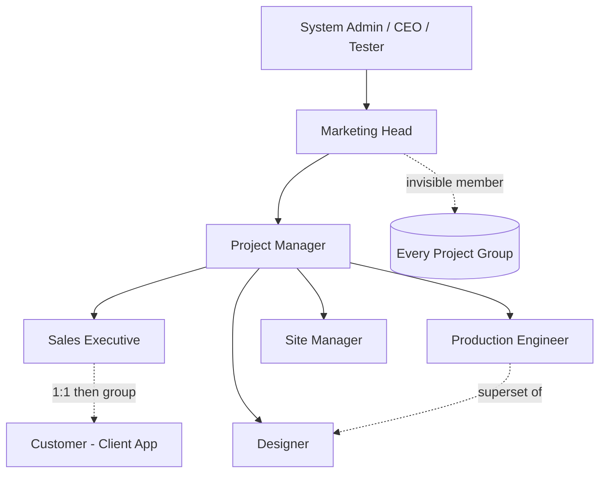
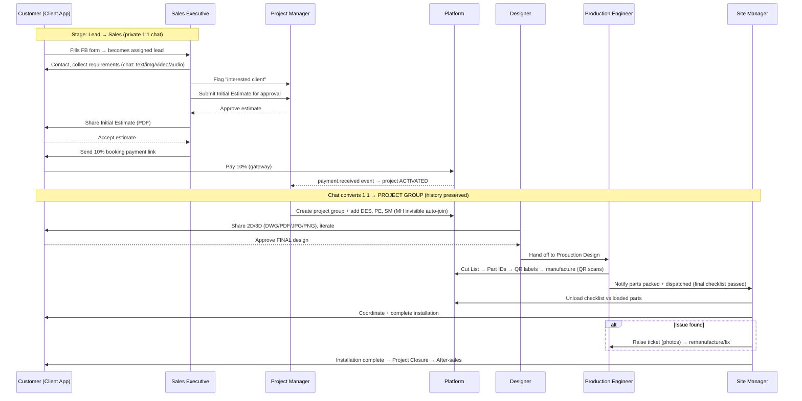
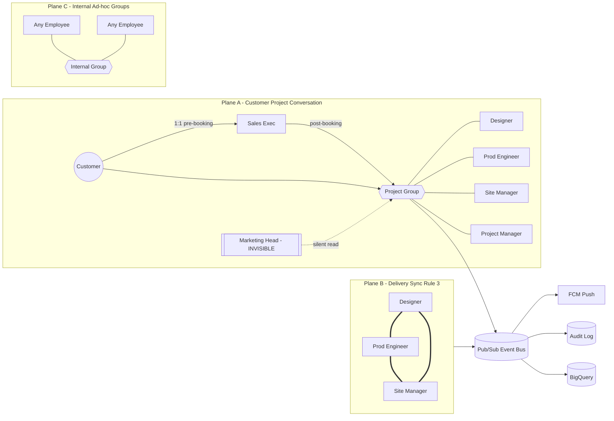
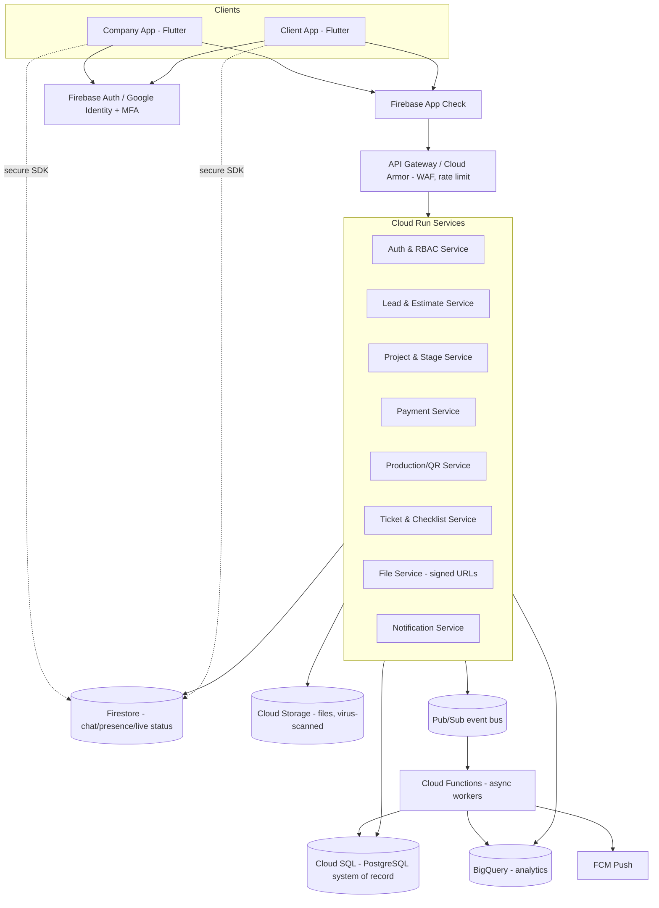
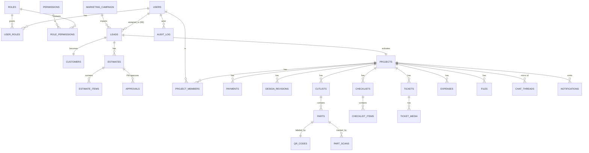
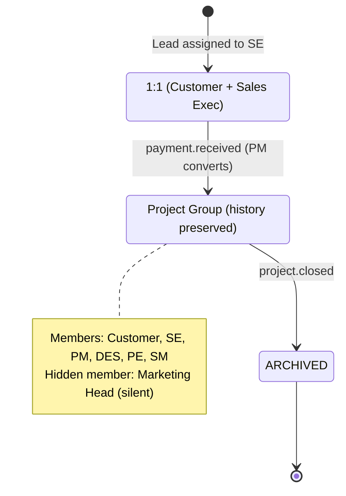

# Interio Junction — Two-App Enterprise Ecosystem

**Company Application** (employees) + **Client Application** (customers)
Production-grade architecture & design specification.

> **Status:** Living document, built in installments.
> **This file — Installment 1** covers sections **1–12**. Sections **13–30** follow in later installments (numbering preserved).
> **Author role stance:** Senior Enterprise Solution Architect · Google Workspace/Cloud Architect · Mobile App Architect · Cybersecurity Architect · Database Architect · System Analyst · UI/UX Architect · Business Process Consultant.

---

## How this maps to the existing Web CRM (read first)

The web CRM already in this repo (FastAPI + PostgreSQL + React, 9‑stage pipeline, custom‑role RBAC/Module 7, audit log, object‑storage documents, Meta lead import, email OTP, Cutlist/BOQ/BOM uploads + Label Generator slot) is a **strong backend foundation we reuse and extend**. The mobile ecosystem is **not a rewrite of the business logic** — it is a **new delivery surface (two mobile apps) + new modules (real‑time chat, QR manufacturing tracking, client‑facing app, payments) on a Google Cloud runtime.**

Where your instructions below conflict with the current web CRM, **the instructions win** (as you directed). The most important deliberate deviations are called out in **§30 Risks/Assumptions** and inline as `⚠ Deviation`.

Key mapping at a glance:

| New concept (your prompt) | Existing CRM equivalent | Action |
|---|---|---|
| Marketing Head | *(none — above `manager`)* | **New role**, superset of Project Manager + Excel upload |
| Project Manager | `manager` role | Reuse + extend (lead split, group creation, approvals) |
| Sales Executive | `sales` role | Reuse (lead handling, estimate, booking) |
| Designer | `designer` role | Reuse (2D/3D, DWG/PDF/JPG/PNG) |
| Production Engineer | *(partial: Cutlist/BOQ/BOM upload)* | **New role**, superset of Designer + factory/QR |
| Site Manager | `supervisor` role | Reuse + extend (installation, tickets, bills) |
| Customer | *(lead record, no login)* | **New: customer becomes an authenticated app user** |
| 9‑stage pipeline | `Leads…Factory Production` | Reuse as the project state machine |
| Chat | *(none)* | **New real‑time module (Firestore)** |
| QR part tracking | Label Generator placeholder | **New full lifecycle module** |
| Estimate | Lead scoring only | **New estimate engine (Excel‑driven, later)** |
| Payments | *(milestone rail, manual)* | **New: online 10% booking + gateway** |

---

## Table of Contents

| # | Section | Installment |
|---|---|---|
| 1 | Executive Summary | ✅ 1 |
| 2 | Business Process Analysis | ✅ 1 |
| 3 | Actors and Roles | ✅ 1 |
| 4 | Role-Based Access Matrix (RBAC) | ✅ 1 |
| 5 | End-to-End Customer Journey | ✅ 1 |
| 6 | End-to-End Internal Workflow | ✅ 1 |
| 7 | Communication Flow Diagram | ✅ 1 |
| 8 | Application Architecture | ✅ 1 |
| 9 | Module Breakdown | ✅ 1 |
| 10 | Database Design (ERD) | ✅ 1 |
| 11 | API Architecture | ✅ 1 |
| 12 | Chat System Design | ✅ 1 |
| 13 | File Management Design | ⏳ 2 |
| 14 | QR Tracking Architecture | ⏳ 2 |
| 15 | Estimate Engine Design | ⏳ 2 |
| 16 | Payment Workflow | ⏳ 2 |
| 17 | Production Workflow | ⏳ 2 |
| 18 | Installation Workflow | ⏳ 2 |
| 19 | Notification Architecture | ⏳ 3 |
| 20 | Security Architecture | ⏳ 3 |
| 21 | Cybersecurity Threat Model & Mitigations | ⏳ 3 |
| 22 | Google Cloud Architecture | ⏳ 3 |
| 23 | Scalability Strategy | ⏳ 4 |
| 24 | Disaster Recovery & Backup Plan | ⏳ 4 |
| 25 | UI/UX Navigation Structure | ⏳ 4 |
| 26 | Admin Console Design | ⏳ 4 |
| 27 | Client Application Design | ⏳ 4 |
| 28 | Company Application Design | ⏳ 4 |
| 29 | Recommended Technology Stack | ⏳ 5 |
| 30 | Risks, Assumptions, and Recommendations | ⏳ 5 |

---

# 1. Executive Summary

Interio Junction is a modular‑interiors manufacturer whose value chain runs from a **Facebook lead** all the way to an **installed kitchen/wardrobe on a customer's site**, passing through sales, estimation, booking, design, factory production, quality, dispatch and installation. Today that chain is coordinated over phone calls, spreadsheets and a web CRM. The goal of this program is to move the **entire lifecycle into two mobile applications** so that every hand‑off, approval, file and conversation is captured, traceable, and role‑appropriate.

**What we are building**

- **Company App** — the operational cockpit for ~100 employees across 6 roles (Marketing Head → Project Manager → Sales Executive, Designer, Production Engineer, Site Manager). It handles lead distribution, estimation & approvals, project groups, factory QR tracking, checklists, tickets and expense approvals.
- **Client App** — a clean, trust‑building app for customers to chat with the company, receive & approve estimates, pay the booking amount, review designs, and track their project to installation.

**The two apps are two front‑ends over one secure backend.** They exchange data only through governed APIs and a shared real‑time layer. A customer never sees internal cost sheets; an employee never loses the audit trail.

**Design pillars**

1. **Role is destiny.** Every screen, API and message is gated by a central RBAC service (extending the web CRM's Module 7 permission model). Two relationships are first‑class: *Production Engineer ⊇ Designer* (superset) and *Marketing Head ⊇ Project Manager + lead‑upload*.
2. **Conversation is the spine.** The project lives inside a chat thread that **starts 1:1 (customer ↔ sales)** and **graduates into a transparent project group** at booking — with full history carried forward, and a **silent, invisible Marketing Head** on every group.
3. **Every physical part is a database row.** From the Cut List onward, each part carries a **Unique Part ID + QR code**, and its journey through the factory and onto the site is a stream of scan events — full traceability.
4. **Google‑native, security‑first.** Built on Firebase + Google Cloud (Identity/MFA, Firestore, Cloud SQL, Cloud Storage, Cloud Run, FCM, BigQuery) with OWASP‑grade controls, encryption in transit & at rest, audit logging and least privilege throughout.
5. **Designed for scale from day one:** 100 employees, 10k customers, 100k projects, millions of messages/files — horizontally scalable, highly available, with a tested disaster‑recovery posture.

**Recommended stack (detailed in §29):** **Flutter** (single codebase → both apps, Android‑first per your "Google applications" requirement, iOS‑ready) · **Firebase** (Auth, Firestore, FCM, App Check) · **Google Cloud** (Cloud Run APIs, Cloud SQL for PostgreSQL as the system of record, Cloud Storage for files, BigQuery for analytics). This reuses the existing PostgreSQL data model and Python domain logic — we lift the FastAPI services onto Cloud Run rather than rebuild them.

**Phasing (high level):** (P0) Auth + RBAC + Lead pipeline parity with the CRM; (P1) Chat + Estimate + Booking payment; (P2) Design collaboration + Production/QR; (P3) Installation/Tickets/Checklists + Client App polish; (P4) Analytics, hardening, DR drills. Full plan in §23/§30.

---

# 2. Business Process Analysis

The business is a **make‑to‑order manufacturing pipeline** with a long, multi‑department hand‑off chain and a customer who must be kept informed and progressively committed (interest → estimate → 10% booking → design sign‑off → production → installation). The core analytical findings that shape the architecture:

**2.1 It is a state machine with gated transitions.** A project cannot jump stages arbitrarily; each transition has **entry preconditions and an owning role**. This is exactly the "blueprint gate" concept already in the web CRM (`evaluate_gate`) and we keep it. Example gates: *Booking* requires estimate approval + 10% payment; *Production Design* requires a customer‑approved final design; *Dispatch* requires a passed factory checklist.

**2.2 Commitment is monetized early.** The **10% booking payment is the pivot of the whole system** — it is the event that (a) activates the project, (b) converts the private sales chat into a transparent project group, and (c) unlocks the design stage. Everything before it is "sales"; everything after is "delivery." The architecture treats the *payment‑received* event as a first‑class domain event that fans out to chat, groups, notifications and stage transition.

**2.3 There are two distinct trust boundaries.** (i) *Customer ↔ Company* (the Client App must never leak internal cost, margin, factory or staffing data) and (ii) *Intra‑company* (role‑scoped visibility, e.g., a Sales Executive sees their leads, a Project Manager sees all projects they own). Every API response must be filtered on both boundaries.

**2.4 The physical world must reconcile with the digital record.** The Cut List → parts → QR → scans → site‑delivery checklist is a **reconciliation loop**: what was designed = what was cut = what was packed = what was loaded = what was unloaded = what was installed. Discrepancies (missing/damaged parts) generate **tickets** that route back to the Production Engineer. This loop is the operational heart of §14/§17/§18.

**2.5 Transparency is mandated but scoped.** Designer / Production Engineer / Site Manager must be **synchronized in real time** (Rule 3). The Marketing Head must be **omnipresent but invisible** (Rule 2). Employees may also spin up **ad‑hoc internal groups** (Rule 5). These three visibility rules are not UI conveniences — they are security requirements and are enforced server‑side.

**2.6 Exceptions are normal, not edge cases.** Damaged parts, missing parts, fitting errors, site bills, remanufacture requests, design revisions, estimate revisions, refunds — these recur on almost every project. The system is designed so each has a first‑class workflow (ticket, revision, expense‑approval) rather than being handled off‑platform.

**Identified data flows (summary):**

- **Inbound:** Facebook Lead Ads → Excel → Marketing Head upload → lead import (reuse existing Meta importer).
- **Internal fan‑out:** lead distribution (MH→PM→SE), estimate approval (SE→PM), project group creation (PM), production hand‑off (Designer→PE), site hand‑off (PE→SM).
- **Customer‑facing:** estimate delivery & acceptance, booking payment, design review & approval, progress tracking, installation confirmation.
- **Physical→digital:** QR scans at each factory/site station.
- **Cross‑cutting:** chat messages/files, notifications, audit events, checklists with photo evidence & e‑signatures.

---

# 3. Actors and Roles

### 3.1 Company App actors (employees)

| Role | One‑line mandate | Superset relationship | CRM mapping |
|---|---|---|---|
| **Marketing Head (MH)** | Owns lead supply & silent oversight of every project | ⊇ Project Manager **+** Excel upload **+** invisible group membership | New role |
| **Project Manager (PM)** | Owns delivery of a set of projects end‑to‑end | — | `manager` (extended) |
| **Sales Executive (SE)** | Converts a lead into a booked project | — | `sales` |
| **Designer (DES)** | Produces & finalizes 2D/3D designs with the customer | — | `designer` |
| **Production Engineer (PE)** | Turns final design into parts, QR, factory output, dispatch | ⊇ Designer | New role (extends `designer`) |
| **Site Manager (SM)** | Installs on site, verifies, raises tickets, logs bills | — | `supervisor` (extended) |

### 3.2 Client App actor

| Role | Mandate |
|---|---|
| **Customer (CUS)** | Chat with company, receive/approve estimate, pay booking, review/approve designs, track project, confirm installation, after‑sales. |

### 3.3 System / platform actors

| Actor | Mandate |
|---|---|
| **System Administrator** | Tenant config, role catalog, integrations, security policy, break‑glass. (Maps to CRM `ceo`/`admin`; the **CEO/Tester** super‑accounts remain the platform owners.) |
| **Automation/Service accounts** | Payment gateway webhooks, FCM sender, importer, QR label service, virus scanner, BigQuery ETL. Least‑privilege service identities. |
| **3rd‑Party Vendor (installation)** | Coordinated *by* the Site Manager. **Not a first‑class app user in v1** (⚠ Assumption — see §30); represented as a managed entity the SM assigns tasks to, with optional lightweight OTP link later. |

### 3.4 Hierarchy



**Notes on the hierarchy that drive permissions:**
- MH **manages PMs directly** and inherits everything a PM can do (so MH can act on any project). The one thing only MH can do: **upload the Ad Campaign Excel** and be an **invisible** member.
- PM is the **coordination hub**: reads *all* communication on projects they own, approves estimates & expenses, creates project groups, adds members.
- PE **inherits all Designer abilities** and adds factory/QR/dispatch — so a PE can open/annotate designs, not just cut lists.
- SM is site‑side authority: checklists, tickets, vendor coordination, bills.

---

# 4. Role-Based Access Matrix (RBAC)

**Model:** we extend the web CRM's Module 7 permission layer (a catalog of fine‑grained permission keys, roles = sets of keys, checked server‑side on every request). Below, **C**=Create, **R**=Read, **U**=Update, **D**=Delete/Deactivate, **A**=Approve, **—**=No access, **R*** = read **scoped** to own/owned records, **R‡** = read **all** (oversight). Marketing Head oversight reads are **silent** where noted.

### 4.1 Capability matrix (company app)

| Capability / Permission key | MH | PM | SE | DES | PE | SM | CUS |
|---|:--:|:--:|:--:|:--:|:--:|:--:|:--:|
| `leads.upload_excel` (Ad campaign import) | **C** | — | — | — | — | — | — |
| `leads.distribute_to_pm` | C | — | — | — | — | — | — |
| `leads.assign_to_se` (manual/auto split) | CRU | CRU | — | — | — | — | — |
| `leads.view` | R‡ | R‡(own projects) | R* | — | — | — | — |
| `leads.edit` / status | RU | RU | RU* | — | — | — | — |
| `estimate.create` | CRU | R | **CRU** | — | — | — | — |
| `estimate.approve` | **A** | **A** | — | — | — | — | — |
| `estimate.share_to_customer` | RU | RU | **RU** | — | — | — | R |
| `estimate.accept` | — | — | — | — | — | — | **A** |
| `payment.request_booking` | R | R | **CR** | — | — | — | R |
| `payment.pay` | — | — | — | — | — | — | **C** |
| `payment.verify` | R‡ | **A** | R* | — | — | — | R* |
| `project.activate` (post‑payment) | R | **U(auto)** | R | — | — | — | R |
| `project.group.create` | R | **C** | R(added) | R(added) | R(added) | R(added) | R(added) |
| `project.group.add_member` | R | **CU** | — | — | — | — | — |
| `project.view` | **R‡ silent** | R‡(owned) | R*(assigned) | R*(assigned) | R*(assigned) | R*(assigned) | R*(own) |
| `design.create/upload` (DWG/PDF/JPG/PNG) | R | R | R | **CRU** | **CRU** | R | R(shared) |
| `design.finalize` (customer‑approved) | R | A | R | RU | RU | R | **A** |
| `production.cutlist.create` | R | R | — | — | **CRU** | R | — |
| `production.partid_qr.generate` | R | R | — | — | **C** | R | — |
| `production.scan_update` (QR stage) | R | R‡ | — | — | **CU** | R | — |
| `production.qc / assembly / packing` | R | R‡ | — | — | **CU** | R | — |
| `factory.checklist.complete` | R | A | — | — | **CU** | R | — |
| `dispatch.create` | R | R‡ | — | — | **CU** | R | R(status) |
| `site.checklist.load_unload` | R | R‡ | — | — | R | **CU** | R(status) |
| `ticket.raise` (damaged/missing/fitting) | R | R‡ | — | — | R(assigned) | **C** | — |
| `ticket.resolve` (remanufacture/fix) | R | A | — | — | **CU** | RU | — |
| `expense.upload_bill` (site) | R | A | — | — | — | **C** | — |
| `expense.approve` | R | **A** | — | — | — | R* | — |
| `chat.project_group` | **R‡ silent** | RW | RW | RW | RW | RW | RW |
| `chat.internal_group.create` | RW | RW | RW | RW | RW | RW | — |
| `notifications.receive` | ✓all | ✓owned | ✓scoped | ✓scoped | ✓scoped | ✓scoped | ✓own |
| `analytics.company` (BigQuery dashboards) | R‡ | R‡(owned) | R* | R* | R* | R* | — |
| `admin.roles/permissions` | — | — | — | — | — | — | — (System Admin only) |

### 4.2 The three special visibility rules as access rules

- **Invisible Marketing Head (Rule 2):** MH has `project.view = R‡ silent` and `chat.project_group = R‡ silent`. Server‑side, MH is a member row with `visibility='hidden'`. **Every API that returns group membership, presence, typing, or read‑receipts MUST exclude hidden members.** MH's own reads generate **no** read‑receipts and **no** presence. (Full implementation in §12.)
- **Transparent Delivery Trio (Rule 3):** DES, PE, SM assigned to a project share a **single synchronized project state**; any write by one publishes a real‑time event consumed by the other two (progress, files, tasks, status, tickets). Enforced via a shared `project_id` channel + fan‑out (see §7/§12/§19).
- **Internal Groups (Rule 5):** any employee (not customers) may create `chat.internal_group` across departments; these are **isolated** from customer project groups and never contain a Customer.

### 4.3 Principle of least privilege

Every role is granted **only** the keys in its column. Superset roles (PE⊇DES, MH⊇PM) are modeled by **including the subordinate role's key set** at seed time, not by ad‑hoc `if role==` checks — so the matrix stays the single source of truth (mirrors the CRM's `ROLE_DEFAULTS`). System Admin can mint **custom roles** (Module 7) with arbitrary key subsets for future titles (e.g., "QC Inspector").

---

# 5. End-to-End Customer Journey

From the **customer's** point of view (Client App), with the company events that mirror each step.



**Customer‑visible milestones (Client App timeline):** *Enquiry received → Estimate received → Estimate accepted → Booking paid → Design in progress → Design approved → In production → Dispatched → Installation scheduled → Installed → Closed.* These map to the 9‑stage pipeline but are **relabeled for the customer** (no "cut list", "BOQ", margins, or internal stage names are shown).

**What the customer can and cannot see:** ✔ their chat/group (post‑booking), estimate PDF, payment receipts, design files shared to them, high‑level status, installation schedule, tickets *they* would care about (e.g., "replacement dispatched"). ✘ internal cost sheets, BOQ/BOM, factory QR internals, staff assignments beyond names/roles, other customers, expense bills, margins.

---

# 6. End-to-End Internal Workflow

The company‑side chain, expressed as the **project state machine** (reusing the 9 pipeline stages as the backbone) plus the owning role and the gate for each transition.

| # | Stage (internal) | Owner | Entry gate (must be true to enter) | Key artifacts produced |
|---|---|---|---|---|
| 1 | **Leads** | SE (assigned by MH→PM) | Lead imported & assigned | Lead record, requirement notes |
| 2 | **Initial Estimate** | SE | Requirements captured | Estimate v1 (draft) |
| 3 | **Consultation** | SE | Estimate submitted → **PM approved** | Approved estimate PDF shared |
| 4 | **Booking** | SE→PM | Customer accepted **+ 10% paid & verified** | Payment receipt, **project activated**, **group created** |
| 5 | **Site Measurement** | SM/SE | Project active | Measurement sheet *(kept from CRM; ⚠ see note)* |
| 6 | **Design** | DES | Booking done | 2D/3D files, **customer‑approved final design** |
| 7 | **Production Design** | PE | Final design approved | **Cut List, Part IDs, QR labels, BOQ/BOM** |
| 8 | **Revised Estimate** | SE/PE→PM | Cut list finalized | Revised/final estimate *(if scope changed)* |
| 9 | **Factory Production → Dispatch** | PE | Revised estimate settled | Manufactured parts, QC, packing, **factory checklist**, dispatch |
| 10 | **Installation** *(sub‑stage of 9→closure)* | SM | Parts dispatched | Load/unload checklist, installation, tickets, bills, **completion checklist** |
| 11 | **Closure / After‑sales** | PM | Installation checklist signed | Sign‑off, warranty, after‑sales tickets |

> ⚠ **Deviation/decision:** Your new flow does not emphasize a separate *Site Measurement* stage (5) and instead surfaces the Site Manager at installation. The CRM has stage 5 = Site Measurement. **Recommendation:** keep stage 5 as an *optional* measurement checkpoint (many modular jobs still need it) but do **not** gate Booking→Design on it. If you want it removed entirely from the mobile flow, that is a one‑line stage‑map change — flagged in §30 for your decision.

**Internal hand‑off events (each fires notifications + audit + real‑time sync):**
1. `lead.assigned` (MH→PM→SE) 2. `estimate.submitted` (SE→PM) 3. `estimate.approved` (PM→SE) 4. `payment.received` (Sys→PM, **the pivot**) 5. `group.created` (PM) 6. `design.finalized` (DES→PE, customer‑approved) 7. `cutlist.published` (PE) 8. `part.scanned` (PE/floor, many) 9. `checklist.factory.passed` (PE→SM) 10. `dispatch.created` (PE→SM) 11. `unload.verified` (SM) 12. `ticket.raised` (SM→PE) 13. `ticket.resolved` (PE→SM) 14. `expense.submitted`/`expense.approved` (SM→PM) 15. `project.closed` (PM).

Every one of these is a **domain event** on an event bus (Pub/Sub) that drives chat system messages, FCM notifications, BigQuery analytics, and the transparent‑trio sync.

---

# 7. Communication Flow Diagram

Three communication planes coexist. Keeping them separate in the design is what makes the visibility rules enforceable.

**Plane A — Customer↔Company (the project conversation).** Starts as SE↔Customer 1:1; becomes the project group at booking.
**Plane B — Intra‑company delivery sync (Rule 3).** DES/PE/SM real‑time state channel per project.
**Plane C — Ad‑hoc internal groups (Rule 5).** Employee‑created, cross‑department, no customers.



**Rules encoded in the diagram:**
- The **only** bridge between customer and delivery team is the **Project Group** (Plane A). A customer can never be added to Plane B or Plane C.
- **MH** attaches to every Plane‑A group with `visibility=hidden`; MH consumes the message stream via the event bus, **not** via a visible membership.
- Plane B is an **employee‑only mirror** of delivery state; it exists so DES/PE/SM stay synced even outside the customer‑facing chatter (e.g., "QC failed on part IJ‑P‑0142" is a Plane‑B/Plane‑C concern, not something pushed into the customer group).

---

# 8. Application Architecture

**Style:** two thin, offline‑capable **Flutter mobile clients** over a **modular service backend on Google Cloud**, with a **real‑time layer (Firestore + FCM)** for chat/presence/notifications and a **relational system‑of‑record (Cloud SQL / PostgreSQL)** for the transactional core. An **API Gateway** fronts stateless services on **Cloud Run**; asynchronous work flows over **Pub/Sub + Cloud Functions**.



**Why this shape:**
- **Firestore for chat/live, Cloud SQL for truth.** Firestore gives us real‑time fan‑out, offline sync, presence and read‑receipts out of the box (perfect for §12), while the money/parts/audit data stays in a strongly‑consistent relational store (reusing the CRM schema). We **do not** put financial or QR‑traceability truth in Firestore; we mirror *just enough* for the UI.
- **Cloud Run = lift the existing FastAPI services.** The web CRM's Python domain services (leads, stages, gates, documents, audit, RBAC) are containerized already — they move to Cloud Run with minimal change, giving us proven business logic on a Google‑native, autoscaling runtime.
- **Pub/Sub between services** decouples the 15 hand‑off events (§6) from their many side‑effects (notify, analytics, sync, checklist triggers) — essential for the "everything notifies everyone relevant" requirement without tight coupling.
- **App Check + API Gateway + Cloud Armor** form the front security wall (device attestation, WAF, rate limiting, schema validation) before any request reaches a service.

**Two apps, one backend, separate BFFs.** Each app talks to a role‑appropriate **Backend‑for‑Frontend** facade: the **Client BFF** exposes only customer‑safe fields & endpoints; the **Company BFF** exposes the full, RBAC‑filtered surface. This is the primary structural defense against cross‑boundary data leaks (§2.3).

---

# 9. Module Breakdown

Each module = an owning service + its data + its screens in each app. (⭐ = new vs. web CRM; ♻ = reuse/extend CRM.)

| Module | Purpose | Owning service | Company App | Client App |
|---|---|---|---|---|
| **Identity & RBAC** ♻ | Login, MFA, roles, permission checks | Auth & RBAC | Login, profile, role admin | Login, profile |
| **Lead Intake & Distribution** ♻ | Excel import, MH→PM→SE split | Lead & Estimate | Import, assign (manual/auto) | — |
| **CRM / Lead Handling** ♻ | Contact, requirements, status | Lead & Estimate | Lead list/detail | — |
| **Estimate Engine** ⭐ | Create/version/approve/share estimate | Lead & Estimate | Create Estimate, approve | View/accept estimate |
| **Payments** ⭐ | 10% booking, invoices, receipts, refunds | Payment | Verify, history | Pay, receipts |
| **Project & Stage** ♻ | State machine, gates, membership | Project & Stage | Project board (Projects page) | My project timeline |
| **Chat** ⭐ | 1:1, project group, internal groups | (Firestore + Chat svc) | All chats | Sales/project chat |
| **Design Collaboration** ♻ | 2D/3D file share, revisions, approval | File + Project | Design workspace | Review & approve designs |
| **Production & QR** ⭐ | Cut list, Part IDs, QR, scans, QC, packing | Production/QR | Factory floor, scanner | Progress (high level) |
| **Dispatch & Logistics** ⭐ | Pack, final checklist, dispatch | Production/QR | Dispatch, checklists | Dispatch status |
| **Installation & Site** ⭐ | Load/unload checklist, install, vendors | Ticket & Checklist | Site console | Install schedule/confirm |
| **Tickets** ⭐ | Damaged/missing/fitting issues + photos | Ticket & Checklist | Raise/resolve | (surfaced if relevant) |
| **Expenses** ⭐ | Site bills w/ photo, PM approval | Ticket & Checklist | Upload/approve | — |
| **Checklists** ⭐ | Factory/pack/load/unload/install/closure + e‑sign | Ticket & Checklist | All checklists | Sign where required |
| **Files** ♻ | Upload/preview/version/permission | File | Everywhere | Shared files only |
| **Notifications** ♻ | Push/email/SMS/in‑app, escalations | Notification | All | Own |
| **Audit & Compliance** ♻ | Immutable action log, tamper‑evident | Auth & RBAC | Audit console (admin) | — |
| **Analytics** ⭐ | BigQuery dashboards, daily summary | (BigQuery) | Role dashboards | — |

---

# 10. Database Design (ERD)

**Polyglot persistence, one source of truth per fact.** Transactional/traceability/financial data → **Cloud SQL (PostgreSQL)** (extends the existing CRM schema). Real‑time conversational/presence data → **Firestore**. Binary files → **Cloud Storage** (only metadata rows live in SQL). Analytics copies → **BigQuery**.

### 10.1 Relational core (Cloud SQL / PostgreSQL) — logical ERD



### 10.2 Key tables (new/extended shown; existing CRM tables reused verbatim where possible)

- **users** ♻ (+ `mfa_enabled`, `fcm_tokens[]`, `reports_to` for hierarchy).
- **roles / permissions / role_permissions** ♻ (Module 7) — seed new roles MH, PE and their key sets; PE inherits DES keys, MH inherits PM keys + `leads.upload_excel`.
- **marketing_campaigns** ⭐ (`id`, `name`, `source=facebook`, `sheet_ref`, `uploaded_by(MH)`, `lead_count`).
- **leads** ♻ (+ `campaign_id`, `pm_id`, `se_id`, `flagged_interested`).
- **customers** ⭐ (the customer's *authenticated identity* for the Client App: `id`, `lead_id`, `phone` (unique), `email` (unique), `auth_uid`). *(Phone+Email as the customer's primary keys — from your earlier feature request.)*
- **estimates** ⭐ + **estimate_items** ⭐ (`version`, `status[draft/submitted/approved/shared/accepted/revised]`, `subtotal/tax/discount/total`, `pdf_ref`, `approved_by`). *Pricing engine plugs in later from your Excel.*
- **projects** ♻ (the 9‑stage record; + `activated_at`, `booking_paid`, `group_thread_id`).
- **project_members** ⭐ (`project_id`, `user_id`, `role_in_project`, `visibility[normal/hidden]`) — **`hidden` is how the invisible MH is stored.**
- **payments** ♻/⭐ (`type[booking/milestone]`, `amount`, `gateway_ref`, `status`, `verified_by`, `receipt_ref`).
- **design_revisions** ♻ (+ `customer_approved_at`).
- **cutlists** ⭐, **parts** ⭐ (`part_uid` = human+QR id e.g. `IJ‑{project}‑P‑0001`, `material`, `dims`, `qty`, `status`), **qr_codes** ⭐ (`part_id`, `payload_signed`, `png_ref`), **part_scans** ⭐ (`part_id`, `station`, `stage`, `scanned_by`, `ts`, `result`) — the traceability spine (§14).
- **checklists** ⭐ + **checklist_items** ⭐ (`type[factory/pack/load/unload/install/closure]`, `item`, `checked`, `photo_ref`, `signature_ref`).
- **tickets** ⭐ + **ticket_media** ⭐ (`kind[damaged/missing/fitting]`, `priority`, `status`, `raised_by(SM)`, `assigned_to(PE)`, photos/videos).
- **expenses** ⭐ (`amount`, `bill_photo_ref`, `status`, `approved_by(PM)`).
- **files** ♻ (metadata only; bytes in GCS; `version`, `checksum`, `scan_status`, `visibility`).
- **audit_log** ♻ (immutable, append‑only, tamper‑evident hash chain — see §20).
- **notifications** ♻.

### 10.3 Firestore collections (real‑time)

```
/threads/{threadId}            (type: dm|project|internal, members[], hiddenMembers[], projectId?)
/threads/{threadId}/messages/{msgId}   (sender, body, attachments[], replyTo?, mentions[], ts, deliveredTo[], readBy[])
/threads/{threadId}/typing/{userId}
/presence/{userId}             (state, lastSeen)   // hidden members excluded from reads
/projectLiveStatus/{projectId} (stage, lastEvent, updatedBy)   // Plane-B delivery sync mirror
```

Firestore holds **conversation & presence**; the **authoritative** membership, permissions and project state live in Cloud SQL and are pushed into Firestore by the backend (never trusted from the client). Security Rules on Firestore are a *second* gate, not the primary one (§20).

---

# 11. API Architecture

**Pattern:** REST/JSON over HTTPS through an **API Gateway**, split into **two BFFs** (Client, Company) plus shared domain services; **real‑time via Firestore SDK** (reads) with **all writes through the backend** (so RBAC, validation and audit always run server‑side); **webhooks** for payment gateway; **Pub/Sub** for internal events.

### 11.1 Conventions
- **AuthN:** Firebase ID token (Google Identity) in `Authorization: Bearer`; verified at the gateway; short‑lived access + refresh; **MFA** enforced for privileged roles.
- **AuthZ:** every endpoint declares a required permission key; the RBAC middleware (ported from the CRM's `require_permission`) checks it and applies **row‑level scoping** (own/owned/all) before returning data.
- **Idempotency:** all mutating endpoints accept an `Idempotency-Key` (critical for payments, scans, imports).
- **Versioning:** `/v1/...`; additive changes only within a version.
- **Envelopes:** consistent `{data, error, meta}`; pagination via cursors; strict request‑schema validation (reject unknown fields → anti‑over‑posting).

### 11.2 Representative endpoints (Company BFF)

| Method & path | Permission | Notes |
|---|---|---|
| `POST /v1/campaigns/import` | `leads.upload_excel` | MH only; multipart Excel → importer (reuse Meta importer) |
| `POST /v1/leads/distribute` | `leads.distribute_to_pm` | equal split MH→PMs |
| `POST /v1/leads/{id}/assign` | `leads.assign_to_se` | manual or `?strategy=auto_equal` |
| `POST /v1/estimates` | `estimate.create` | SE creates draft |
| `POST /v1/estimates/{id}/submit` | `estimate.create` | → PM approval queue |
| `POST /v1/estimates/{id}/approve` | `estimate.approve` | PM/MH |
| `POST /v1/estimates/{id}/share` | `estimate.share_to_customer` | generates PDF, notifies customer |
| `POST /v1/payments/{proj}/verify` | `payment.verify` | PM confirms; **idempotent** |
| `POST /v1/projects/{id}/group` | `project.group.create` | PM; converts DM→group, carries history |
| `POST /v1/projects/{id}/members` | `project.group.add_member` | PM adds DES/PE/SM; MH auto‑hidden by system |
| `POST /v1/cutlists` / `…/parts` | `production.cutlist.create` | PE |
| `POST /v1/parts/{uid}/scan` | `production.scan_update` | QR scan station update; idempotent per station |
| `POST /v1/checklists/{id}/items/{i}` | `factory/site.checklist.*` | photo + e‑sign |
| `POST /v1/tickets` | `ticket.raise` | SM; media upload |
| `POST /v1/tickets/{id}/resolve` | `ticket.resolve` | PE |
| `POST /v1/expenses` / `…/approve` | `expense.upload_bill` / `expense.approve` | SM / PM |
| `POST /v1/files:signed-url` | scoped | returns short‑lived GCS PUT/GET URL (§13) |

### 11.3 Representative endpoints (Client BFF) — deliberately narrow
`GET /v1/me/project` · `GET /v1/estimates/{id}` · `POST /v1/estimates/{id}/accept` · `POST /v1/payments/booking:create-order` · `GET /v1/payments/history` · `GET /v1/designs?shared=1` · `POST /v1/designs/{id}/approve` · `GET /v1/project/timeline` · `GET/POST /v1/chat/...` (Firestore‑backed). **No** endpoint on the Client BFF can return cost items, BOQ/BOM, parts, expenses, staff assignments or other customers.

### 11.4 Real‑time & async
- **Firestore SDK (client → read‑only subscriptions)** for messages/presence/live status; **writes go to `POST /v1/chat/messages`** which validates, applies visibility, persists to Firestore + audit, and fans out.
- **Payment webhook:** `POST /v1/webhooks/payment` (gateway‑signed, verified, idempotent) → `payment.received` event.
- **Pub/Sub topics:** `lead-events`, `estimate-events`, `payment-events`, `project-events`, `production-events`, `ticket-events`, `notification-fanout`, `analytics-etl`.

---

# 12. Chat System Design

The chat module implements the **Chat Lifecycle (Rule 1)**, **Invisible Marketing Head (Rule 2)**, **Transparent trio (Rule 3)**, and **Internal groups (Rule 5)** — this is the most nuanced part of the system, so it is specified carefully.

### 12.1 Thread types & lifecycle



- A thread has `type ∈ {dm, project, internal}`, `members[]`, `hiddenMembers[]`, `projectId?`.
- **Conversion (DM→project) is a metadata change, not a copy:** the same `threadId` keeps all prior messages/files; we flip `type=project`, add members, and record a system message *"Project group created — <n> members added."* This satisfies "history & files remain visible" **by construction** (nothing is migrated, so nothing is lost).
- **Message model:** `sender, body, attachments[] (image/video/audio/pdf/dwg/…), replyTo, mentions[], threadId, ts, deliveredTo[], readBy[], pinned, edited`.
- **Features:** 1:1, project group, internal group, file sharing, **voice notes**, images/videos, **read receipts, typing, presence, mentions (@), replies/threading, pinned messages, search, notifications** — all standard Firestore + FCM patterns.

### 12.2 The Invisible Marketing Head — secure implementation

This is a security feature, not a UI trick. The MH must **read everything and stay unseen across every leak channel**.

1. **Membership:** MH is stored in `hiddenMembers[]`, never in `members[]`. All membership/roster APIs return `members[]` only → MH never appears in the participant list.
2. **Delivery/read receipts:** the fan‑out worker **never** adds MH to `deliveredTo[]`/`readBy[]`. So the customer/team never see an unexplained read.
3. **Presence & typing:** MH's client runs in a **read‑only, presence‑suppressed mode** — it subscribes to messages but is blocked (by Firestore Security Rules + client policy) from writing `typing/*` or `presence/*` for MH’s own uid.
4. **Message authorship guard:** if MH *chooses to intervene*, sending a message **reveals them** (it must — a message needs a visible author). The app warns MH: *"Sending will reveal you in this group."* Silent monitoring = read; intervention = deliberate, logged reveal.
5. **Notifications:** MH receives a **separate, private oversight notification stream** ("new activity in Project X") via the event bus — **not** a group push that others could correlate.
6. **Audit:** MH's reads are recorded in the **admin‑only** audit log (oversight is itself auditable), but never surfaced to group members.
7. **Enforcement location:** all of the above is enforced **server‑side + Firestore Security Rules**, never in client code alone (a tampered client must not be able to unmask MH — because the roster it receives simply never contained MH).

### 12.3 Transparent delivery trio (Rule 3)
DES/PE/SM share `/projectLiveStatus/{projectId}` and are **all** normal members of the project group. Additionally, delivery‑only events (QC fail, cut‑list published, ticket raised) publish to a **per‑project delivery channel** that pushes an in‑app + FCM update to exactly those three roles, so they stay synced even about things that never enter the customer chat. A write by any of the three updates the shared status doc → the other two see it live.

### 12.4 Internal groups (Rule 5)
Any employee creates `type=internal` threads with any employees (cross‑department). Server rule: **`internal` threads may never contain a Customer principal**; **project** threads always contain exactly one Customer. This invariant is validated on every `add_member`.

### 12.5 Data‑at‑rest, retention, moderation
Messages encrypted at rest (Google‑managed keys, optionally CMEK); attachments in GCS with signed‑URL access + virus scan; per‑thread retention policy; legal‑hold capability for disputes; profanity/abuse reporting hooks (customer‑facing safety, Play policy). Deleting a message = tombstone (audit‑preserved), not hard delete, so the record survives for compliance.

---

> **⏸ End of Installment 1 (sections 1–12).**
> **Next — Installment 2 (sections 13–18):** File Management, QR Tracking Architecture, Estimate Engine, Payment Workflow, Production Workflow, Installation Workflow.
> Numbering and continuity are preserved; nothing above will be renumbered.
