# Interio Junction — Two-App Enterprise Ecosystem

**Company Application** (employees) + **Client Application** (customers)
Production-grade architecture & design specification.

> **Status:** ✅ **Complete — all 30 sections** (written across 5 installments; commits `b3bd9bd → a8c52e3 → …`). Design/architecture deliverable only — **not implementation yet** (build proceeds in phases per §30.4 once §30.5 decisions are confirmed).
> **Author role stance:** Senior Enterprise Solution Architect · Google Workspace/Cloud Architect · Mobile App Architect · Cybersecurity Architect · Database Architect · System Analyst · UI/UX Architect · Business Process Consultant.

---

## How this maps to the existing Web CRM (read first)

The web CRM already in this repo (FastAPI + PostgreSQL + React, 9‑stage pipeline, custom‑role RBAC/Module 7, audit log, object‑storage documents, Meta lead import, email OTP, Cutlist/BOQ/BOM uploads + Label Generator slot) is a **strong backend foundation we reuse and extend**. The mobile ecosystem is **not a rewrite of the business logic** — it is a **new delivery surface (two mobile apps) + new modules (real‑time chat, QR manufacturing tracking, client‑facing app, payments) on a Google Cloud runtime.**

Where your instructions below conflict with the current web CRM, **the instructions win** (as you directed). The most important deliberate deviations are called out in **§30 Risks/Assumptions** and inline as `⚠ Deviation`.

Key mapping at a glance:

| New concept (your prompt) | Existing CRM equivalent | Action |
|---|---|---|
| Marketing Head | *(none — above `manager`)* | **New role**, superset of Project Manager + Excel upload |
| Project Manager | `manager` role | Reuse + extend (lead split, group creation, approvals) |
| Sales Executive | `sales` role | Reuse (lead handling, estimate, booking) |
| Designer | `designer` role | Reuse (2D/3D, DWG/PDF/JPG/PNG) |
| Production Engineer | *(partial: Cutlist/BOQ/BOM upload)* | **New role**, superset of Designer + factory/QR |
| Site Manager | `supervisor` role | Reuse + extend (installation, tickets, bills) |
| Customer | *(lead record, no login)* | **New: customer becomes an authenticated app user** |
| 9‑stage pipeline | `Leads…Factory Production` | Reuse as the project state machine |
| Chat | *(none)* | **New real‑time module (Firestore)** |
| QR part tracking | Label Generator placeholder | **New full lifecycle module** |
| Estimate | Lead scoring only | **New estimate engine (Excel‑driven, later)** |
| Payments | *(milestone rail, manual)* | **New: online 10% booking + gateway** |

---

## Table of Contents

| # | Section | Installment |
|---|---|---|
| 1 | Executive Summary | ✅ 1 |
| 2 | Business Process Analysis | ✅ 1 |
| 3 | Actors and Roles | ✅ 1 |
| 4 | Role-Based Access Matrix (RBAC) | ✅ 1 |
| 5 | End-to-End Customer Journey | ✅ 1 |
| 6 | End-to-End Internal Workflow | ✅ 1 |
| 7 | Communication Flow Diagram | ✅ 1 |
| 8 | Application Architecture | ✅ 1 |
| 9 | Module Breakdown | ✅ 1 |
| 10 | Database Design (ERD) | ✅ 1 |
| 11 | API Architecture | ✅ 1 |
| 12 | Chat System Design | ✅ 1 |
| 13 | File Management Design | ✅ 2 |
| 14 | QR Tracking Architecture | ✅ 2 |
| 15 | Estimate Engine Design | ✅ 2 |
| 16 | Payment Workflow | ✅ 2 |
| 17 | Production Workflow | ✅ 2 |
| 18 | Installation Workflow | ✅ 2 |
| 19 | Notification Architecture | ✅ 3 |
| 20 | Security Architecture | ✅ 3 |
| 21 | Cybersecurity Threat Model & Mitigations | ✅ 3 |
| 22 | Google Cloud Architecture | ✅ 3 |
| 23 | Scalability Strategy | ✅ 4 |
| 24 | Disaster Recovery & Backup Plan | ✅ 4 |
| 25 | UI/UX Navigation Structure | ✅ 4 |
| 26 | Admin Console Design | ✅ 4 |
| 27 | Client Application Design | ✅ 4 |
| 28 | Company Application Design | ✅ 4 |
| 29 | Recommended Technology Stack | ✅ 5 |
| 30 | Risks, Assumptions, and Recommendations | ✅ 5 |

---

# 1. Executive Summary

Interio Junction is a modular‑interiors manufacturer whose value chain runs from a **Facebook lead** all the way to an **installed kitchen/wardrobe on a customer's site**, passing through sales, estimation, booking, design, factory production, quality, dispatch and installation. Today that chain is coordinated over phone calls, spreadsheets and a web CRM. The goal of this program is to move the **entire lifecycle into two mobile applications** so that every hand‑off, approval, file and conversation is captured, traceable, and role‑appropriate.

**What we are building**

- **Company App** — the operational cockpit for ~100 employees across 6 roles (Marketing Head → Project Manager → Sales Executive, Designer, Production Engineer, Site Manager). It handles lead distribution, estimation & approvals, project groups, factory QR tracking, checklists, tickets and expense approvals.
- **Client App** — a clean, trust‑building app for customers to chat with the company, receive & approve estimates, pay the booking amount, review designs, and track their project to installation.

**The two apps are two front‑ends over one secure backend.** They exchange data only through governed APIs and a shared real‑time layer. A customer never sees internal cost sheets; an employee never loses the audit trail.

**Design pillars**

1. **Role is destiny.** Every screen, API and message is gated by a central RBAC service (extending the web CRM's Module 7 permission model). Two relationships are first‑class: *Production Engineer ⊇ Designer* (superset) and *Marketing Head ⊇ Project Manager + lead‑upload*.
2. **Conversation is the spine.** The project lives inside a chat thread that **starts 1:1 (customer ↔ sales)** and **graduates into a transparent project group** at booking — with full history carried forward, and a **silent, invisible Marketing Head** on every group.
3. **Every physical part is a database row.** From the Cut List onward, each part carries a **Unique Part ID + QR code**, and its journey through the factory and onto the site is a stream of scan events — full traceability.
4. **Google‑native, security‑first.** Built on Firebase + Google Cloud (Identity/MFA, Firestore, Cloud SQL, Cloud Storage, Cloud Run, FCM, BigQuery) with OWASP‑grade controls, encryption in transit & at rest, audit logging and least privilege throughout.
5. **Designed for scale from day one:** 100 employees, 10k customers, 100k projects, millions of messages/files — horizontally scalable, highly available, with a tested disaster‑recovery posture.

**Recommended stack (detailed in §29):** **Flutter** (single codebase → both apps, Android‑first per your "Google applications" requirement, iOS‑ready) · **Firebase** (Auth, Firestore, FCM, App Check) · **Google Cloud** (Cloud Run APIs, Cloud SQL for PostgreSQL as the system of record, Cloud Storage for files, BigQuery for analytics). This reuses the existing PostgreSQL data model and Python domain logic — we lift the FastAPI services onto Cloud Run rather than rebuild them.

**Phasing (high level):** (P0) Auth + RBAC + Lead pipeline parity with the CRM; (P1) Chat + Estimate + Booking payment; (P2) Design collaboration + Production/QR; (P3) Installation/Tickets/Checklists + Client App polish; (P4) Analytics, hardening, DR drills. Full plan in §23/§30.

---

# 2. Business Process Analysis

The business is a **make‑to‑order manufacturing pipeline** with a long, multi‑department hand‑off chain and a customer who must be kept informed and progressively committed (interest → estimate → 10% booking → design sign‑off → production → installation). The core analytical findings that shape the architecture:

**2.1 It is a state machine with gated transitions.** A project cannot jump stages arbitrarily; each transition has **entry preconditions and an owning role**. This is exactly the "blueprint gate" concept already in the web CRM (`evaluate_gate`) and we keep it. Example gates: *Booking* requires estimate approval + 10% payment; *Production Design* requires a customer‑approved final design; *Dispatch* requires a passed factory checklist.

**2.2 Commitment is monetized early.** The **10% booking payment is the pivot of the whole system** — it is the event that (a) activates the project, (b) converts the private sales chat into a transparent project group, and (c) unlocks the design stage. Everything before it is "sales"; everything after is "delivery." The architecture treats the *payment‑received* event as a first‑class domain event that fans out to chat, groups, notifications and stage transition.

**2.3 There are two distinct trust boundaries.** (i) *Customer ↔ Company* (the Client App must never leak internal cost, margin, factory or staffing data) and (ii) *Intra‑company* (role‑scoped visibility, e.g., a Sales Executive sees their leads, a Project Manager sees all projects they own). Every API response must be filtered on both boundaries.

**2.4 The physical world must reconcile with the digital record.** The Cut List → parts → QR → scans → site‑delivery checklist is a **reconciliation loop**: what was designed = what was cut = what was packed = what was loaded = what was unloaded = what was installed. Discrepancies (missing/damaged parts) generate **tickets** that route back to the Production Engineer. This loop is the operational heart of §14/§17/§18.

**2.5 Transparency is mandated but scoped.** Designer / Production Engineer / Site Manager must be **synchronized in real time** (Rule 3). The Marketing Head must be **omnipresent but invisible** (Rule 2). Employees may also spin up **ad‑hoc internal groups** (Rule 5). These three visibility rules are not UI conveniences — they are security requirements and are enforced server‑side.

**2.6 Exceptions are normal, not edge cases.** Damaged parts, missing parts, fitting errors, site bills, remanufacture requests, design revisions, estimate revisions, refunds — these recur on almost every project. The system is designed so each has a first‑class workflow (ticket, revision, expense‑approval) rather than being handled off‑platform.

**Identified data flows (summary):**

- **Inbound:** Facebook Lead Ads → Excel → Marketing Head upload → lead import (reuse existing Meta importer).
- **Internal fan‑out:** lead distribution (MH→PM→SE), estimate approval (SE→PM), project group creation (PM), production hand‑off (Designer→PE), site hand‑off (PE→SM).
- **Customer‑facing:** estimate delivery & acceptance, booking payment, design review & approval, progress tracking, installation confirmation.
- **Physical→digital:** QR scans at each factory/site station.
- **Cross‑cutting:** chat messages/files, notifications, audit events, checklists with photo evidence & e‑signatures.

---

# 3. Actors and Roles

### 3.1 Company App actors (employees)

| Role | One‑line mandate | Superset relationship | CRM mapping |
|---|---|---|---|
| **Marketing Head (MH)** | Owns lead supply & silent oversight of every project | ⊇ Project Manager **+** Excel upload **+** invisible group membership | New role |
| **Project Manager (PM)** | Owns delivery of a set of projects end‑to‑end | — | `manager` (extended) |
| **Sales Executive (SE)** | Converts a lead into a booked project | — | `sales` |
| **Designer (DES)** | Produces & finalizes 2D/3D designs with the customer | — | `designer` |
| **Production Engineer (PE)** | Turns final design into parts, QR, factory output, dispatch | ⊇ Designer | New role (extends `designer`) |
| **Site Manager (SM)** | Installs on site, verifies, raises tickets, logs bills | — | `supervisor` (extended) |

### 3.2 Client App actor

| Role | Mandate |
|---|---|
| **Customer (CUS)** | Chat with company, receive/approve estimate, pay booking, review/approve designs, track project, confirm installation, after‑sales. |

### 3.3 System / platform actors

| Actor | Mandate |
|---|---|
| **System Administrator** | Tenant config, role catalog, integrations, security policy, break‑glass. (Maps to CRM `ceo`/`admin`; the **CEO/Tester** super‑accounts remain the platform owners.) |
| **Automation/Service accounts** | Payment gateway webhooks, FCM sender, importer, QR label service, virus scanner, BigQuery ETL. Least‑privilege service identities. |
| **3rd‑Party Vendor (installation)** | Coordinated *by* the Site Manager. **Not a first‑class app user in v1** (⚠ Assumption — see §30); represented as a managed entity the SM assigns tasks to, with optional lightweight OTP link later. |

### 3.4 Hierarchy

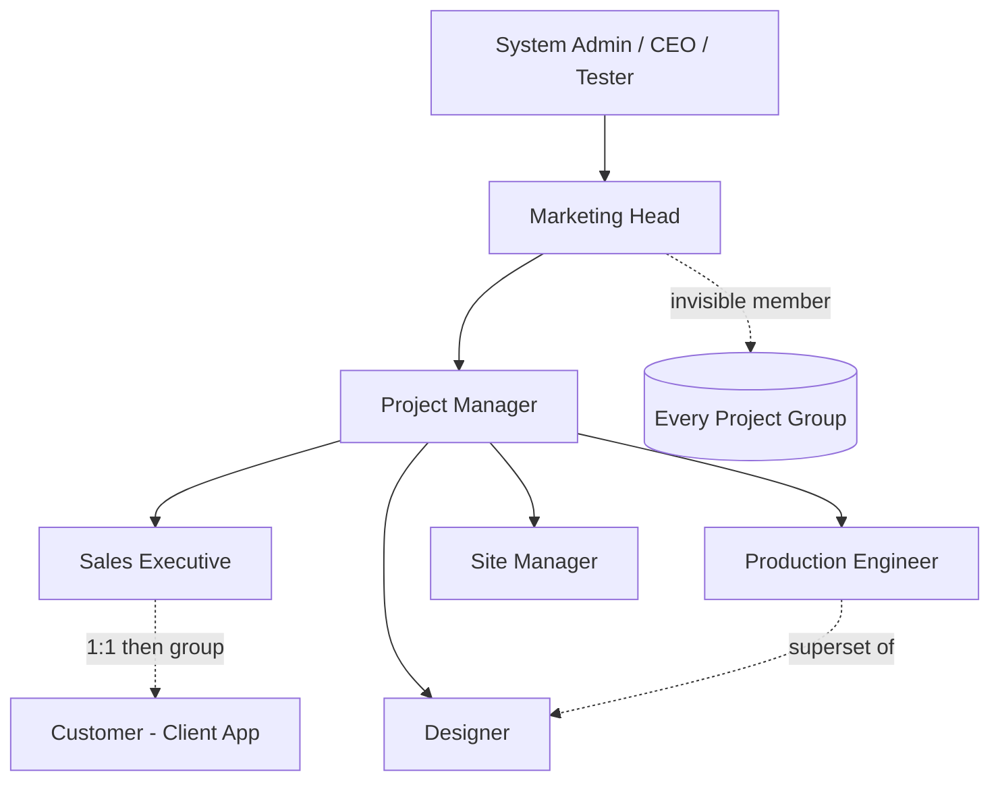

**Notes on the hierarchy that drive permissions:**
- MH **manages PMs directly** and inherits everything a PM can do (so MH can act on any project). The one thing only MH can do: **upload the Ad Campaign Excel** and be an **invisible** member.
- PM is the **coordination hub**: reads *all* communication on projects they own, approves estimates & expenses, creates project groups, adds members.
- PE **inherits all Designer abilities** and adds factory/QR/dispatch — so a PE can open/annotate designs, not just cut lists.
- SM is site‑side authority: checklists, tickets, vendor coordination, bills.

---

# 4. Role-Based Access Matrix (RBAC)

**Model:** we extend the web CRM's Module 7 permission layer (a catalog of fine‑grained permission keys, roles = sets of keys, checked server‑side on every request). Below, **C**=Create, **R**=Read, **U**=Update, **D**=Delete/Deactivate, **A**=Approve, **—**=No access, **R*** = read **scoped** to own/owned records, **R‡** = read **all** (oversight). Marketing Head oversight reads are **silent** where noted.

### 4.1 Capability matrix (company app)

| Capability / Permission key | MH | PM | SE | DES | PE | SM | CUS |
|---|:--:|:--:|:--:|:--:|:--:|:--:|:--:|
| `leads.upload_excel` (Ad campaign import) | **C** | — | — | — | — | — | — |
| `leads.distribute_to_pm` | C | — | — | — | — | — | — |
| `leads.assign_to_se` (manual/auto split) | CRU | CRU | — | — | — | — | — |
| `leads.view` | R‡ | R‡(own projects) | R* | — | — | — | — |
| `leads.edit` / status | RU | RU | RU* | — | — | — | — |
| `estimate.create` | CRU | R | **CRU** | — | — | — | — |
| `estimate.approve` | **A** | **A** | — | — | — | — | — |
| `estimate.share_to_customer` | RU | RU | **RU** | — | — | — | R |
| `estimate.accept` | — | — | — | — | — | — | **A** |
| `payment.request_booking` | R | R | **CR** | — | — | — | R |
| `payment.pay` | — | — | — | — | — | — | **C** |
| `payment.verify` | R‡ | **A** | R* | — | — | — | R* |
| `project.activate` (post‑payment) | R | **U(auto)** | R | — | — | — | R |
| `project.group.create` | R | **C** | R(added) | R(added) | R(added) | R(added) | R(added) |
| `project.group.add_member` | R | **CU** | — | — | — | — | — |
| `project.view` | **R‡ silent** | R‡(owned) | R*(assigned) | R*(assigned) | R*(assigned) | R*(assigned) | R*(own) |
| `design.create/upload` (DWG/PDF/JPG/PNG) | R | R | R | **CRU** | **CRU** | R | R(shared) |
| `design.finalize` (customer‑approved) | R | A | R | RU | RU | R | **A** |
| `production.cutlist.create` | R | R | — | — | **CRU** | R | — |
| `production.partid_qr.generate` | R | R | — | — | **C** | R | — |
| `production.scan_update` (QR stage) | R | R‡ | — | — | **CU** | R | — |
| `production.qc / assembly / packing` | R | R‡ | — | — | **CU** | R | — |
| `factory.checklist.complete` | R | A | — | — | **CU** | R | — |
| `dispatch.create` | R | R‡ | — | — | **CU** | R | R(status) |
| `site.checklist.load_unload` | R | R‡ | — | — | R | **CU** | R(status) |
| `ticket.raise` (damaged/missing/fitting) | R | R‡ | — | — | R(assigned) | **C** | — |
| `ticket.resolve` (remanufacture/fix) | R | A | — | — | **CU** | RU | — |
| `expense.upload_bill` (site) | R | A | — | — | — | **C** | — |
| `expense.approve` | R | **A** | — | — | — | R* | — |
| `chat.project_group` | **R‡ silent** | RW | RW | RW | RW | RW | RW |
| `chat.internal_group.create` | RW | RW | RW | RW | RW | RW | — |
| `notifications.receive` | ✓all | ✓owned | ✓scoped | ✓scoped | ✓scoped | ✓scoped | ✓own |
| `analytics.company` (BigQuery dashboards) | R‡ | R‡(owned) | R* | R* | R* | R* | — |
| `admin.roles/permissions` | — | — | — | — | — | — | — (System Admin only) |

### 4.2 The three special visibility rules as access rules

- **Invisible Marketing Head (Rule 2):** MH has `project.view = R‡ silent` and `chat.project_group = R‡ silent`. Server‑side, MH is a member row with `visibility='hidden'`. **Every API that returns group membership, presence, typing, or read‑receipts MUST exclude hidden members.** MH's own reads generate **no** read‑receipts and **no** presence. (Full implementation in §12.)
- **Transparent Delivery Trio (Rule 3):** DES, PE, SM assigned to a project share a **single synchronized project state**; any write by one publishes a real‑time event consumed by the other two (progress, files, tasks, status, tickets). Enforced via a shared `project_id` channel + fan‑out (see §7/§12/§19).
- **Internal Groups (Rule 5):** any employee (not customers) may create `chat.internal_group` across departments; these are **isolated** from customer project groups and never contain a Customer.

### 4.3 Principle of least privilege

Every role is granted **only** the keys in its column. Superset roles (PE⊇DES, MH⊇PM) are modeled by **including the subordinate role's key set** at seed time, not by ad‑hoc `if role==` checks — so the matrix stays the single source of truth (mirrors the CRM's `ROLE_DEFAULTS`). System Admin can mint **custom roles** (Module 7) with arbitrary key subsets for future titles (e.g., "QC Inspector").

---

# 5. End-to-End Customer Journey

From the **customer's** point of view (Client App), with the company events that mirror each step.

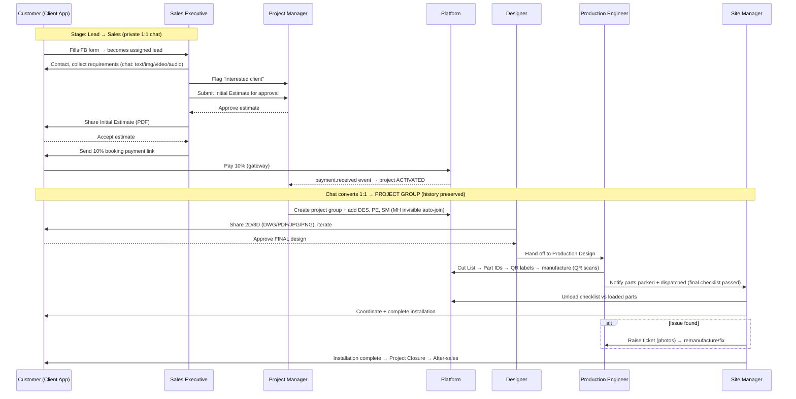

**Customer‑visible milestones (Client App timeline):** *Enquiry received → Estimate received → Estimate accepted → Booking paid → Design in progress → Design approved → In production → Dispatched → Installation scheduled → Installed → Closed.* These map to the 9‑stage pipeline but are **relabeled for the customer** (no "cut list", "BOQ", margins, or internal stage names are shown).

**What the customer can and cannot see:** ✔ their chat/group (post‑booking), estimate PDF, payment receipts, design files shared to them, high‑level status, installation schedule, tickets *they* would care about (e.g., "replacement dispatched"). ✘ internal cost sheets, BOQ/BOM, factory QR internals, staff assignments beyond names/roles, other customers, expense bills, margins.

---

# 6. End-to-End Internal Workflow

The company‑side chain, expressed as the **project state machine** (reusing the 9 pipeline stages as the backbone) plus the owning role and the gate for each transition.

| # | Stage (internal) | Owner | Entry gate (must be true to enter) | Key artifacts produced |
|---|---|---|---|---|
| 1 | **Leads** | SE (assigned by MH→PM) | Lead imported & assigned | Lead record, requirement notes |
| 2 | **Initial Estimate** | SE | Requirements captured | Estimate v1 (draft) |
| 3 | **Consultation** | SE | Estimate submitted → **PM approved** | Approved estimate PDF shared |
| 4 | **Booking** | SE→PM | Customer accepted **+ 10% paid & verified** | Payment receipt, **project activated**, **group created** |
| 5 | **Site Measurement** | SM/SE | Project active | Measurement sheet *(kept from CRM; ⚠ see note)* |
| 6 | **Design** | DES | Booking done | 2D/3D files, **customer‑approved final design** |
| 7 | **Production Design** | PE | Final design approved | **Cut List, Part IDs, QR labels, BOQ/BOM** |
| 8 | **Revised Estimate** | SE/PE→PM | Cut list finalized | Revised/final estimate *(if scope changed)* |
| 9 | **Factory Production → Dispatch** | PE | Revised estimate settled | Manufactured parts, QC, packing, **factory checklist**, dispatch |
| 10 | **Installation** *(sub‑stage of 9→closure)* | SM | Parts dispatched | Load/unload checklist, installation, tickets, bills, **completion checklist** |
| 11 | **Closure / After‑sales** | PM | Installation checklist signed | Sign‑off, warranty, after‑sales tickets |

> ⚠ **Deviation/decision:** Your new flow does not emphasize a separate *Site Measurement* stage (5) and instead surfaces the Site Manager at installation. The CRM has stage 5 = Site Measurement. **Recommendation:** keep stage 5 as an *optional* measurement checkpoint (many modular jobs still need it) but do **not** gate Booking→Design on it. If you want it removed entirely from the mobile flow, that is a one‑line stage‑map change — flagged in §30 for your decision.

**Internal hand‑off events (each fires notifications + audit + real‑time sync):**
1. `lead.assigned` (MH→PM→SE) 2. `estimate.submitted` (SE→PM) 3. `estimate.approved` (PM→SE) 4. `payment.received` (Sys→PM, **the pivot**) 5. `group.created` (PM) 6. `design.finalized` (DES→PE, customer‑approved) 7. `cutlist.published` (PE) 8. `part.scanned` (PE/floor, many) 9. `checklist.factory.passed` (PE→SM) 10. `dispatch.created` (PE→SM) 11. `unload.verified` (SM) 12. `ticket.raised` (SM→PE) 13. `ticket.resolved` (PE→SM) 14. `expense.submitted`/`expense.approved` (SM→PM) 15. `project.closed` (PM).

Every one of these is a **domain event** on an event bus (Pub/Sub) that drives chat system messages, FCM notifications, BigQuery analytics, and the transparent‑trio sync.

---

# 7. Communication Flow Diagram

Three communication planes coexist. Keeping them separate in the design is what makes the visibility rules enforceable.

**Plane A — Customer↔Company (the project conversation).** Starts as SE↔Customer 1:1; becomes the project group at booking.
**Plane B — Intra‑company delivery sync (Rule 3).** DES/PE/SM real‑time state channel per project.
**Plane C — Ad‑hoc internal groups (Rule 5).** Employee‑created, cross‑department, no customers.

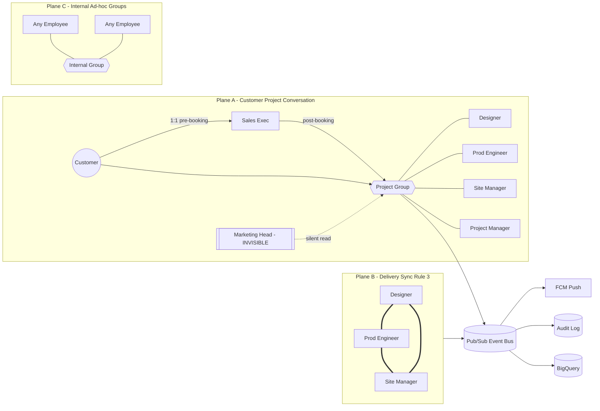

**Rules encoded in the diagram:**
- The **only** bridge between customer and delivery team is the **Project Group** (Plane A). A customer can never be added to Plane B or Plane C.
- **MH** attaches to every Plane‑A group with `visibility=hidden`; MH consumes the message stream via the event bus, **not** via a visible membership.
- Plane B is an **employee‑only mirror** of delivery state; it exists so DES/PE/SM stay synced even outside the customer‑facing chatter (e.g., "QC failed on part IJ‑P‑0142" is a Plane‑B/Plane‑C concern, not something pushed into the customer group).

---

# 8. Application Architecture

**Style:** two thin, offline‑capable **Flutter mobile clients** over a **modular service backend on Google Cloud**, with a **real‑time layer (Firestore + FCM)** for chat/presence/notifications and a **relational system‑of‑record (Cloud SQL / PostgreSQL)** for the transactional core. An **API Gateway** fronts stateless services on **Cloud Run**; asynchronous work flows over **Pub/Sub + Cloud Functions**.

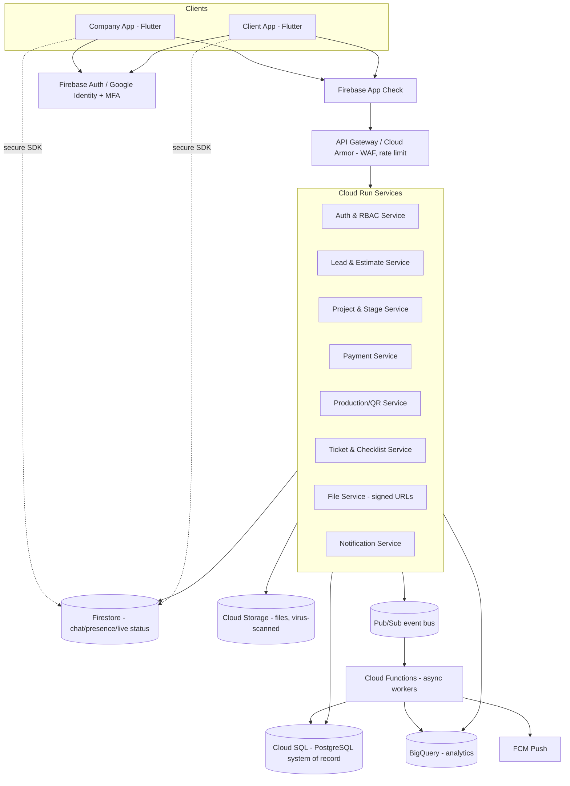

**Why this shape:**
- **Firestore for chat/live, Cloud SQL for truth.** Firestore gives us real‑time fan‑out, offline sync, presence and read‑receipts out of the box (perfect for §12), while the money/parts/audit data stays in a strongly‑consistent relational store (reusing the CRM schema). We **do not** put financial or QR‑traceability truth in Firestore; we mirror *just enough* for the UI.
- **Cloud Run = lift the existing FastAPI services.** The web CRM's Python domain services (leads, stages, gates, documents, audit, RBAC) are containerized already — they move to Cloud Run with minimal change, giving us proven business logic on a Google‑native, autoscaling runtime.
- **Pub/Sub between services** decouples the 15 hand‑off events (§6) from their many side‑effects (notify, analytics, sync, checklist triggers) — essential for the "everything notifies everyone relevant" requirement without tight coupling.
- **App Check + API Gateway + Cloud Armor** form the front security wall (device attestation, WAF, rate limiting, schema validation) before any request reaches a service.

**Two apps, one backend, separate BFFs.** Each app talks to a role‑appropriate **Backend‑for‑Frontend** facade: the **Client BFF** exposes only customer‑safe fields & endpoints; the **Company BFF** exposes the full, RBAC‑filtered surface. This is the primary structural defense against cross‑boundary data leaks (§2.3).

---

# 9. Module Breakdown

Each module = an owning service + its data + its screens in each app. (⭐ = new vs. web CRM; ♻ = reuse/extend CRM.)

| Module | Purpose | Owning service | Company App | Client App |
|---|---|---|---|---|
| **Identity & RBAC** ♻ | Login, MFA, roles, permission checks | Auth & RBAC | Login, profile, role admin | Login, profile |
| **Lead Intake & Distribution** ♻ | Excel import, MH→PM→SE split | Lead & Estimate | Import, assign (manual/auto) | — |
| **CRM / Lead Handling** ♻ | Contact, requirements, status | Lead & Estimate | Lead list/detail | — |
| **Estimate Engine** ⭐ | Create/version/approve/share estimate | Lead & Estimate | Create Estimate, approve | View/accept estimate |
| **Payments** ⭐ | 10% booking, invoices, receipts, refunds | Payment | Verify, history | Pay, receipts |
| **Project & Stage** ♻ | State machine, gates, membership | Project & Stage | Project board (Projects page) | My project timeline |
| **Chat** ⭐ | 1:1, project group, internal groups | (Firestore + Chat svc) | All chats | Sales/project chat |
| **Design Collaboration** ♻ | 2D/3D file share, revisions, approval | File + Project | Design workspace | Review & approve designs |
| **Production & QR** ⭐ | Cut list, Part IDs, QR, scans, QC, packing | Production/QR | Factory floor, scanner | Progress (high level) |
| **Dispatch & Logistics** ⭐ | Pack, final checklist, dispatch | Production/QR | Dispatch, checklists | Dispatch status |
| **Installation & Site** ⭐ | Load/unload checklist, install, vendors | Ticket & Checklist | Site console | Install schedule/confirm |
| **Tickets** ⭐ | Damaged/missing/fitting issues + photos | Ticket & Checklist | Raise/resolve | (surfaced if relevant) |
| **Expenses** ⭐ | Site bills w/ photo, PM approval | Ticket & Checklist | Upload/approve | — |
| **Checklists** ⭐ | Factory/pack/load/unload/install/closure + e‑sign | Ticket & Checklist | All checklists | Sign where required |
| **Files** ♻ | Upload/preview/version/permission | File | Everywhere | Shared files only |
| **Notifications** ♻ | Push/email/SMS/in‑app, escalations | Notification | All | Own |
| **Audit & Compliance** ♻ | Immutable action log, tamper‑evident | Auth & RBAC | Audit console (admin) | — |
| **Analytics** ⭐ | BigQuery dashboards, daily summary | (BigQuery) | Role dashboards | — |

---

# 10. Database Design (ERD)

**Polyglot persistence, one source of truth per fact.** Transactional/traceability/financial data → **Cloud SQL (PostgreSQL)** (extends the existing CRM schema). Real‑time conversational/presence data → **Firestore**. Binary files → **Cloud Storage** (only metadata rows live in SQL). Analytics copies → **BigQuery**.

### 10.1 Relational core (Cloud SQL / PostgreSQL) — logical ERD

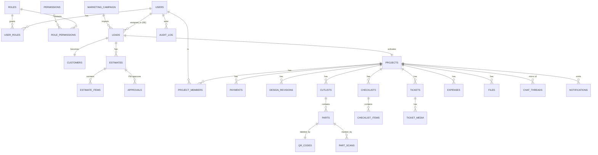

### 10.2 Key tables (new/extended shown; existing CRM tables reused verbatim where possible)

- **users** ♻ (+ `mfa_enabled`, `fcm_tokens[]`, `reports_to` for hierarchy).
- **roles / permissions / role_permissions** ♻ (Module 7) — seed new roles MH, PE and their key sets; PE inherits DES keys, MH inherits PM keys + `leads.upload_excel`.
- **marketing_campaigns** ⭐ (`id`, `name`, `source=facebook`, `sheet_ref`, `uploaded_by(MH)`, `lead_count`).
- **leads** ♻ (+ `campaign_id`, `pm_id`, `se_id`, `flagged_interested`).
- **customers** ⭐ (the customer's *authenticated identity* for the Client App: `id`, `lead_id`, `phone` (unique), `email` (unique), `auth_uid`). *(Phone+Email as the customer's primary keys — from your earlier feature request.)*
- **estimates** ⭐ + **estimate_items** ⭐ (`version`, `status[draft/submitted/approved/shared/accepted/revised]`, `subtotal/tax/discount/total`, `pdf_ref`, `approved_by`). *Pricing engine plugs in later from your Excel.*
- **projects** ♻ (the 9‑stage record; + `activated_at`, `booking_paid`, `group_thread_id`).
- **project_members** ⭐ (`project_id`, `user_id`, `role_in_project`, `visibility[normal/hidden]`) — **`hidden` is how the invisible MH is stored.**
- **payments** ♻/⭐ (`type[booking/milestone]`, `amount`, `gateway_ref`, `status`, `verified_by`, `receipt_ref`).
- **design_revisions** ♻ (+ `customer_approved_at`).
- **cutlists** ⭐, **parts** ⭐ (`part_uid` = human+QR id e.g. `IJ‑{project}‑P‑0001`, `material`, `dims`, `qty`, `status`), **qr_codes** ⭐ (`part_id`, `payload_signed`, `png_ref`), **part_scans** ⭐ (`part_id`, `station`, `stage`, `scanned_by`, `ts`, `result`) — the traceability spine (§14).
- **checklists** ⭐ + **checklist_items** ⭐ (`type[factory/pack/load/unload/install/closure]`, `item`, `checked`, `photo_ref`, `signature_ref`).
- **tickets** ⭐ + **ticket_media** ⭐ (`kind[damaged/missing/fitting]`, `priority`, `status`, `raised_by(SM)`, `assigned_to(PE)`, photos/videos).
- **expenses** ⭐ (`amount`, `bill_photo_ref`, `status`, `approved_by(PM)`).
- **files** ♻ (metadata only; bytes in GCS; `version`, `checksum`, `scan_status`, `visibility`).
- **audit_log** ♻ (immutable, append‑only, tamper‑evident hash chain — see §20).
- **notifications** ♻.

### 10.3 Firestore collections (real‑time)

```
/threads/{threadId}            (type: dm|project|internal, members[], hiddenMembers[], projectId?)
/threads/{threadId}/messages/{msgId}   (sender, body, attachments[], replyTo?, mentions[], ts, deliveredTo[], readBy[])
/threads/{threadId}/typing/{userId}
/presence/{userId}             (state, lastSeen)   // hidden members excluded from reads
/projectLiveStatus/{projectId} (stage, lastEvent, updatedBy)   // Plane-B delivery sync mirror
```

Firestore holds **conversation & presence**; the **authoritative** membership, permissions and project state live in Cloud SQL and are pushed into Firestore by the backend (never trusted from the client). Security Rules on Firestore are a *second* gate, not the primary one (§20).

---

# 11. API Architecture

**Pattern:** REST/JSON over HTTPS through an **API Gateway**, split into **two BFFs** (Client, Company) plus shared domain services; **real‑time via Firestore SDK** (reads) with **all writes through the backend** (so RBAC, validation and audit always run server‑side); **webhooks** for payment gateway; **Pub/Sub** for internal events.

### 11.1 Conventions
- **AuthN:** Firebase ID token (Google Identity) in `Authorization: Bearer`; verified at the gateway; short‑lived access + refresh; **MFA** enforced for privileged roles.
- **AuthZ:** every endpoint declares a required permission key; the RBAC middleware (ported from the CRM's `require_permission`) checks it and applies **row‑level scoping** (own/owned/all) before returning data.
- **Idempotency:** all mutating endpoints accept an `Idempotency-Key` (critical for payments, scans, imports).
- **Versioning:** `/v1/...`; additive changes only within a version.
- **Envelopes:** consistent `{data, error, meta}`; pagination via cursors; strict request‑schema validation (reject unknown fields → anti‑over‑posting).

### 11.2 Representative endpoints (Company BFF)

| Method & path | Permission | Notes |
|---|---|---|
| `POST /v1/campaigns/import` | `leads.upload_excel` | MH only; multipart Excel → importer (reuse Meta importer) |
| `POST /v1/leads/distribute` | `leads.distribute_to_pm` | equal split MH→PMs |
| `POST /v1/leads/{id}/assign` | `leads.assign_to_se` | manual or `?strategy=auto_equal` |
| `POST /v1/estimates` | `estimate.create` | SE creates draft |
| `POST /v1/estimates/{id}/submit` | `estimate.create` | → PM approval queue |
| `POST /v1/estimates/{id}/approve` | `estimate.approve` | PM/MH |
| `POST /v1/estimates/{id}/share` | `estimate.share_to_customer` | generates PDF, notifies customer |
| `POST /v1/payments/{proj}/verify` | `payment.verify` | PM confirms; **idempotent** |
| `POST /v1/projects/{id}/group` | `project.group.create` | PM; converts DM→group, carries history |
| `POST /v1/projects/{id}/members` | `project.group.add_member` | PM adds DES/PE/SM; MH auto‑hidden by system |
| `POST /v1/cutlists` / `…/parts` | `production.cutlist.create` | PE |
| `POST /v1/parts/{uid}/scan` | `production.scan_update` | QR scan station update; idempotent per station |
| `POST /v1/checklists/{id}/items/{i}` | `factory/site.checklist.*` | photo + e‑sign |
| `POST /v1/tickets` | `ticket.raise` | SM; media upload |
| `POST /v1/tickets/{id}/resolve` | `ticket.resolve` | PE |
| `POST /v1/expenses` / `…/approve` | `expense.upload_bill` / `expense.approve` | SM / PM |
| `POST /v1/files:signed-url` | scoped | returns short‑lived GCS PUT/GET URL (§13) |

### 11.3 Representative endpoints (Client BFF) — deliberately narrow
`GET /v1/me/project` · `GET /v1/estimates/{id}` · `POST /v1/estimates/{id}/accept` · `POST /v1/payments/booking:create-order` · `GET /v1/payments/history` · `GET /v1/designs?shared=1` · `POST /v1/designs/{id}/approve` · `GET /v1/project/timeline` · `GET/POST /v1/chat/...` (Firestore‑backed). **No** endpoint on the Client BFF can return cost items, BOQ/BOM, parts, expenses, staff assignments or other customers.

### 11.4 Real‑time & async
- **Firestore SDK (client → read‑only subscriptions)** for messages/presence/live status; **writes go to `POST /v1/chat/messages`** which validates, applies visibility, persists to Firestore + audit, and fans out.
- **Payment webhook:** `POST /v1/webhooks/payment` (gateway‑signed, verified, idempotent) → `payment.received` event.
- **Pub/Sub topics:** `lead-events`, `estimate-events`, `payment-events`, `project-events`, `production-events`, `ticket-events`, `notification-fanout`, `analytics-etl`.

---

# 12. Chat System Design

The chat module implements the **Chat Lifecycle (Rule 1)**, **Invisible Marketing Head (Rule 2)**, **Transparent trio (Rule 3)**, and **Internal groups (Rule 5)** — this is the most nuanced part of the system, so it is specified carefully.

### 12.1 Thread types & lifecycle

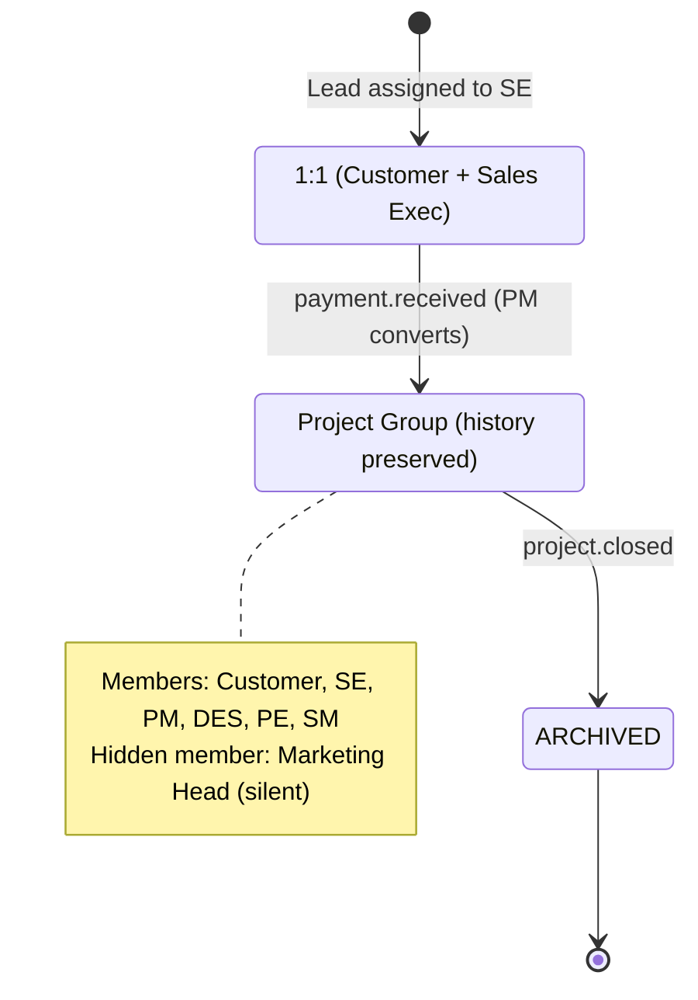

- A thread has `type ∈ {dm, project, internal}`, `members[]`, `hiddenMembers[]`, `projectId?`.
- **Conversion (DM→project) is a metadata change, not a copy:** the same `threadId` keeps all prior messages/files; we flip `type=project`, add members, and record a system message *"Project group created — <n> members added."* This satisfies "history & files remain visible" **by construction** (nothing is migrated, so nothing is lost).
- **Message model:** `sender, body, attachments[] (image/video/audio/pdf/dwg/…), replyTo, mentions[], threadId, ts, deliveredTo[], readBy[], pinned, edited`.
- **Features:** 1:1, project group, internal group, file sharing, **voice notes**, images/videos, **read receipts, typing, presence, mentions (@), replies/threading, pinned messages, search, notifications** — all standard Firestore + FCM patterns.

### 12.2 The Invisible Marketing Head — secure implementation

This is a security feature, not a UI trick. The MH must **read everything and stay unseen across every leak channel**.

1. **Membership:** MH is stored in `hiddenMembers[]`, never in `members[]`. All membership/roster APIs return `members[]` only → MH never appears in the participant list.
2. **Delivery/read receipts:** the fan‑out worker **never** adds MH to `deliveredTo[]`/`readBy[]`. So the customer/team never see an unexplained read.
3. **Presence & typing:** MH's client runs in a **read‑only, presence‑suppressed mode** — it subscribes to messages but is blocked (by Firestore Security Rules + client policy) from writing `typing/*` or `presence/*` for MH’s own uid.
4. **Message authorship guard:** if MH *chooses to intervene*, sending a message **reveals them** (it must — a message needs a visible author). The app warns MH: *"Sending will reveal you in this group."* Silent monitoring = read; intervention = deliberate, logged reveal.
5. **Notifications:** MH receives a **separate, private oversight notification stream** ("new activity in Project X") via the event bus — **not** a group push that others could correlate.
6. **Audit:** MH's reads are recorded in the **admin‑only** audit log (oversight is itself auditable), but never surfaced to group members.
7. **Enforcement location:** all of the above is enforced **server‑side + Firestore Security Rules**, never in client code alone (a tampered client must not be able to unmask MH — because the roster it receives simply never contained MH).

### 12.3 Transparent delivery trio (Rule 3)
DES/PE/SM share `/projectLiveStatus/{projectId}` and are **all** normal members of the project group. Additionally, delivery‑only events (QC fail, cut‑list published, ticket raised) publish to a **per‑project delivery channel** that pushes an in‑app + FCM update to exactly those three roles, so they stay synced even about things that never enter the customer chat. A write by any of the three updates the shared status doc → the other two see it live.

### 12.4 Internal groups (Rule 5)
Any employee creates `type=internal` threads with any employees (cross‑department). Server rule: **`internal` threads may never contain a Customer principal**; **project** threads always contain exactly one Customer. This invariant is validated on every `add_member`.

### 12.5 Data‑at‑rest, retention, moderation
Messages encrypted at rest (Google‑managed keys, optionally CMEK); attachments in GCS with signed‑URL access + virus scan; per‑thread retention policy; legal‑hold capability for disputes; profanity/abuse reporting hooks (customer‑facing safety, Play policy). Deleting a message = tombstone (audit‑preserved), not hard delete, so the record survives for compliance.

---

# 13. File Management Design

Files are central: chat attachments (image/video/audio), design deliverables (**DWG/PDF/JPG/PNG**), cut lists (PDF), estimate PDFs, checklist photos, ticket media, site bills. Volumes reach **millions of files**, so files are treated as a first‑class, secured subsystem.

**13.1 Storage topology.** Bytes live in **Google Cloud Storage**; **only metadata** lives in Cloud SQL (`files` table: `owner, project_id, kind, mime, size, checksum(sha256), version, visibility, scan_status, gcs_object, created_by`). This mirrors the web CRM's "documents metadata in DB, bytes in object storage" pattern.

**13.2 Upload/download via short‑lived signed URLs (never proxy bytes through the app servers).**
```mermaid
sequenceDiagram
  participant App
  participant FileSvc as File Service
  participant GCS
  participant Scan as Malware Scan (Cloud Fn)
  App->>FileSvc: POST /files:signed-url (kind, mime, size, project)
  FileSvc->>FileSvc: RBAC + quota + mime/size policy check
  FileSvc-->>App: short-lived resumable PUT URL + fileId (status=uploading)
  App->>GCS: PUT bytes (resumable, client-side)
  GCS-->>Scan: object.finalize event
  Scan->>GCS: scan; set status=clean|quarantined
  Scan->>FileSvc: update metadata (checksum, scan_status)
  Note over App: download uses signed GET URL only if scan_status=clean & RBAC passes
```

**13.3 Security controls (expanded in §20/§21).** Enforced MIME allow‑list per context (e.g., Client App chat: images/video/audio/pdf only; Designer: +dwg); **max‑size** & rate limits; **virus/malware scan** on every object before it is downloadable; **content‑disposition + no‑sniff** to defeat file‑upload XSS; **signed URLs** expire in minutes and are single‑purpose (PUT vs GET); **object‑level IAM** so the bucket is never public; **CMEK** encryption option; **image/PDF re‑rendering** (strip metadata/active content) for customer‑shared design previews.

**13.4 Preview.** In‑app preview for images/video/audio/PDF; **DWG** is previewed via a server‑side render‑to‑PDF/PNG thumbnail (CAD engine on Cloud Run) since phones can't open DWG natively — the original DWG remains downloadable for CAD users.

**13.5 Versioning & permissions.** Each re‑upload to the same logical slot creates a new `version` (old versions retained, immutable) — essential for **design revisions** and **estimate versions**. `visibility ∈ {internal, project, customer}` decides who can request a signed URL: e.g., a BOQ PDF is `internal` (customer can never obtain a URL), an approved 3D render is `customer`.

**13.6 Search.** Metadata indexed in Cloud SQL (name, kind, project, uploader, date); full‑text/OCR search (optional) via Document AI → BigQuery for scanned bills/checklists.

**13.7 Lifecycle.** GCS lifecycle rules: hot → nearline (90d) → coldline (1y) for finished projects; legal‑hold overrides; per‑customer export/delete for GDPR (§20).

---

# 14. QR Tracking Architecture

Implements **Rule 4**: every manufactured part has a **Unique Part ID + QR** and a fully traceable lifecycle updated by scanning. This is the bridge between the digital cut list and the physical factory/site — the operational heart of the system.

**14.1 Identity.** When the Production Engineer publishes a cut list, the system generates one **`part_uid`** per part: human‑readable + globally unique, e.g. `IJ-{projectCode}-P-0142`. The QR encodes a **signed** payload (`part_uid` + short HMAC), so a scanned code can be verified as genuinely issued by us (anti‑spoof) without a DB round‑trip to reject fakes.

**14.2 Part state machine (each transition = a scan event).**
```mermaid
stateDiagram-v2
  [*] --> Queued: cutlist.published
  Queued --> Cutting
  Cutting --> Edgebanding
  Edgebanding --> Drilling
  Drilling --> QC_Part: quality check (part)
  QC_Part --> Rework: fail
  Rework --> QC_Part
  QC_Part --> Assembly: pass
  Assembly --> QC_Assembly
  QC_Assembly --> Packed
  Packed --> Loaded
  Loaded --> Dispatched
  Dispatched --> Unloaded: site scan
  Unloaded --> Installed
  Installed --> [*]
  Unloaded --> TicketRaised: damaged/missing
  Installed --> TicketRaised: fitting error
  TicketRaised --> Remanufacture --> Queued
```
*(Stations are configurable per factory; the diagram is the reference flow.)*

**14.3 Scan event model.** `part_scans(part_id, station, from_stage, to_stage, scanned_by, device_id, ts, gps?, result[pass/fail/na], note, photo_ref?)`. Scans are **append‑only** (immutable history) and **idempotent per (part, station)** so a double‑scan doesn't double‑advance. Offline scans queue on the device and sync when connectivity returns (factories have dead zones).

**14.4 Traceability queries** (BigQuery + Cloud SQL): *where is part IJ‑…‑P‑0142 right now?*, *which parts of Project X are still in Cutting?*, *show every scan of this part with who/when/where*, *reconcile designed vs cut vs packed vs unloaded vs installed counts*. The **reconciliation view** powers the load/unload checklist (§18) and instantly reveals missing parts.

**14.5 Label generation.** A Cloud Run **Label Service** turns the cut list into printable label sheets (part id, QR PNG, project, material, dims) — this is where **your existing "Label Generator" solution plugs in** (the web CRM already reserves this slot). Output: PDF/ZPL for factory label printers.

**14.6 Progress roll‑up.** Part‑level states aggregate to a **project production % complete**, shown to PE/PM in full detail and to the **customer as a coarse "In production" bar** (never part‑level internals). Every scan publishes `production-events` → notifications to the transparent trio (Rule 3) + project timeline.

**14.7 Security.** Signed QR payloads; scan endpoint requires `production.scan_update` + device attestation (App Check); rate‑limited; GPS/photo optional evidence; scans are audited. A stolen phone cannot forge progress (server validates role, station sequence sanity, and HMAC).

---

# 15. Estimate Engine Design

The estimate is the commercial contract seed. You will provide a **structured Excel** later; the architecture makes the pricing engine **pluggable** so we can wire your logic in without redesign — exactly mirroring how the web CRM keeps the Label Generator and SMS sender pluggable.

**15.1 Data model.** `estimates(project/lead_id, version, status, currency, subtotal, discount, tax, total, valid_until, pdf_ref, created_by, approved_by)` + `estimate_items(estimate_id, category, description, unit, qty, rate, amount, meta jsonb)`. **Versioned**: every change spawns a new version; old versions immutable (audit/dispute).

**15.2 Status workflow (approval built in).**
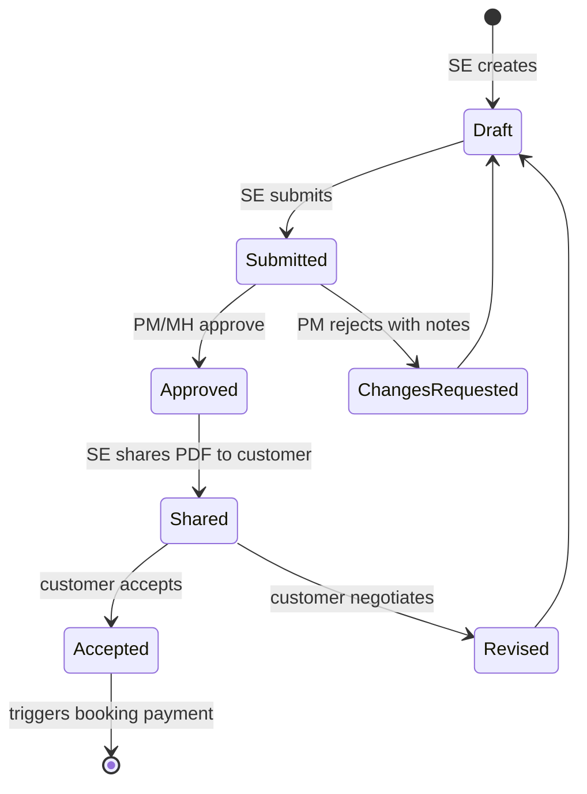

**15.3 Pricing engine (pluggable).** A `PricingStrategy` interface: input = structured requirement/BOQ rows (from your Excel schema), output = priced `estimate_items` + totals. v1 = **Excel‑derived rules** (rate cards, area/linear‑ft formulas, unit costs) loaded as versioned **rate‑card** config; v2 (later) could add ML/optimization. Because the interface is fixed, swapping strategies never touches the workflow/UI.

**15.4 Discount, tax, compliance.** Rule‑based discounts (role‑capped: SE up to X%, PM up to Y%, beyond → MH approval); **GST**‑ready tax module (India: CGST/SGST/IGST, HSN codes per item); rounding rules; **Create Estimate** button in the Company App produces a branded **PDF** (Cloud Run PDF service) with T&C and validity.

**15.5 Customer acceptance.** Client App shows the estimate PDF + line summary (customer‑safe view — no internal cost/margin columns) and an **Accept** action that is legally logged (timestamp, device, IP → audit) and immediately opens the **10% booking payment** (§16).

**15.6 Later "Revised Estimate" (stage 8).** After the cut list/BOQ, scope may change; a revised estimate follows the same versioned workflow and, if the delta is material, re‑enters approval and customer acceptance.

---

# 16. Payment Workflow

The **10% booking payment is the system pivot** (activates project, converts chat to group, unlocks design). Payments are handled by a dedicated service with a certified gateway — **never** by storing card data ourselves.

**16.1 Gateway.** Integrate an India‑first PCI‑DSS‑certified gateway (Razorpay/PayU/Cashfree) or Google Pay UPI. We store only **tokens/refs**, never PAN/CVV. (⚠ Assumption: gateway TBD — §30.)

**16.2 Booking flow (idempotent, webhook‑verified).**
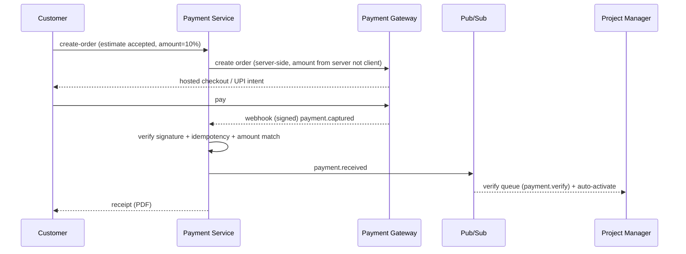
**Amount is always computed server‑side** from the accepted estimate (never trust a client‑sent amount — anti‑tamper). Webhook is **signature‑verified + idempotent** (a replayed webhook can't double‑activate).

**16.3 Verification & activation.** On verified capture → `project.activate` (stage → Booking), `group.create` prompt to PM, notifications to team + customer, receipt generation. PM sees a **verify** step for reconciliation, but activation can be automatic on verified webhook to remove delay.

**16.4 Beyond booking.** Milestone payments (design approval, pre‑production, handover — the CRM already models a milestone rail), **invoice generation**, **payment history**, **receipts**, and **refund handling** (partial/full, with approval + audit + gateway refund API). All payment records are immutable + audited; reconciliation exports to BigQuery for finance.

**16.5 Security.** No card data at rest; webhook allow‑list + HMAC; idempotency keys; amount/currency server‑authoritative; rate‑limited; every state change audited; refund requires PM/MH approval (privilege‑separated from the SE who collects).

---

# 17. Production Workflow

Owned by the **Production Engineer** (⊇ Designer). Turns the customer‑approved final design into physical, tracked, quality‑checked, dispatched units.

**17.1 Flow.**
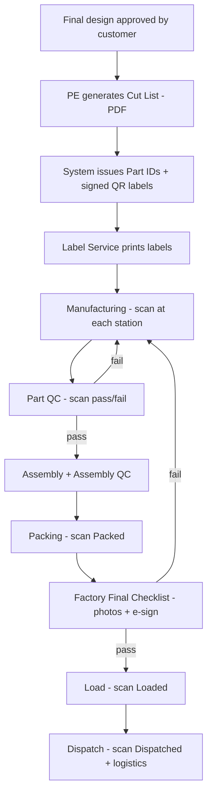

**17.2 Factory floor console (Company App, PE + operators).** Production queue by project/station; **QR scanner** (camera) for stage updates; machine/station status board; per‑part & per‑project timeline; QC capture (pass/fail + photo); **inventory consumption** (board/hardware deducted as parts are cut — links to an inventory table); WIP dashboards. Coordinates continuously with Designer (design queries) and Site Manager (dispatch ETA) — all three synced (Rule 3).

**17.3 Cut List ↔ BOQ/BOM.** The cut list yields parts (for QR/traceability); the **BOQ/BOM** (already uploadable in the web CRM) feeds inventory consumption and the revised estimate. These stay **internal** (customer never sees them).

**17.4 Quality gates.** Part‑level QC and assembly‑level QC are **mandatory scan gates** — a part cannot advance to Packed without a QC pass scan; a project cannot Dispatch without the **Factory Final Checklist** completed & e‑signed. This is the digital enforcement of "ensure quality before it leaves the factory."

**17.5 Dispatch.** On checklist pass → **loading**: each part scanned `Loaded` (builds the authoritative *loaded manifest*), then `Dispatched` with logistics info (vehicle, driver, ETA, optional GPS). The loaded manifest is what the Site Manager reconciles against on arrival (§18).

**17.6 Events.** `cutlist.published`, `part.scanned` (many), `qc.failed`, `checklist.factory.passed`, `dispatch.created` → notifications to trio + PM + customer‑timeline (coarse), analytics to BigQuery.

---

# 18. Installation Workflow

Owned by the **Site Manager** (extends `supervisor`). Reconciles the physical delivery, installs (via vendors), handles exceptions, and closes the project.

**18.1 Flow.**
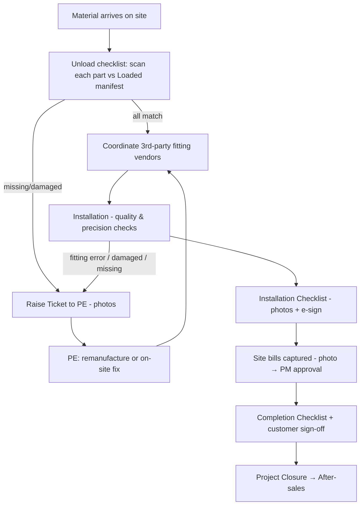

**18.2 Load/unload reconciliation (required feature).** The SM scans parts on arrival; the app compares **Unloaded** scans to the **Loaded** manifest (§17.5) and **auto‑flags any missing part** — no manual counting. This is the "verify all loaded parts are unloaded" requirement, implemented via the QR traceability spine.

**18.3 Tickets (required feature, with image upload).** For **damaged / missing / fitting‑error** parts, the SM raises a ticket (`kind`, `priority`, description, **photos/videos**) assigned to the **Production Engineer**; PE resolves via **remanufacture** (re‑enters the part into production, §14.2) or an on‑site fix. Status/updates sync to the trio + PM in real time; the customer sees a reassuring, non‑technical status ("replacement being prepared").

**18.4 Site expenses (required feature).** Any on‑site cost is captured via **camera** (bill photo) → **PM approval** workflow → recorded expense (audited). Privilege separation: SM submits, PM approves.

**18.5 Vendor coordination.** 3rd‑party fitting vendors are managed entities the SM assigns tasks to and tracks; v1 keeps them off‑app (SM is the accountable user). Optional future: lightweight OTP‑link vendor access (⚠ §30).

**18.6 Closure & after‑sales.** Completion checklist (photos + e‑sign by SM and customer) → project closed → warranty/after‑sales tickets can still be raised by the customer from the Client App, routing to PM.

---

# 19. Notification Architecture

Notifications are how the "everyone relevant is kept in sync" requirement (Rules 3 & 4, every hand‑off event) is actually felt by users. Design goal: **the right person, on the right channel, for the right event — with role‑scoping and escalation — and never a leak** (e.g., the invisible MH's oversight pings must not be visible to the group).

**19.1 Channels.** **Push (FCM)** primary for mobile; **in‑app** notification center (persisted, read/unread); **email** (transactional — reuse the CRM's SMTP or Google Workspace) for approvals/receipts/summaries; **SMS** for high‑value/critical or when push is undelivered (pluggable, mirrors the CRM's deferred‑SMS design). 

**19.2 Event → notification fan‑out.**
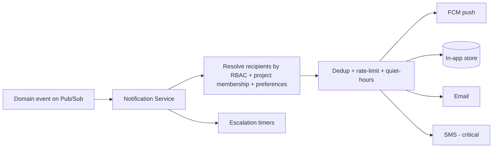
The Notification Service subscribes to every domain topic (§6), **resolves recipients from the RBAC/membership model** (so a customer never gets an internal QC‑fail ping; the trio always gets production events; the MH gets a **private** oversight ping), applies **preferences, dedup, rate‑limit and quiet hours**, then dispatches per channel.

**19.3 Role‑based alert examples.**
| Event | SE | PM | DES | PE | SM | MH | Customer |
|---|:--:|:--:|:--:|:--:|:--:|:--:|:--:|
| `estimate.submitted` | — | 🔔 approve | — | — | — | 🔕 silent | — |
| `payment.received` | 🔔 | 🔔 | 🔔 | 🔔 | 🔔 | 🔕 | 🔔 receipt |
| `design.finalized` | — | 🔔 | 🔔 | 🔔 | — | 🔕 | 🔔 |
| `qc.failed` | — | 🔔 | 🔔 | 🔔 | 🔔 | 🔕 | — |
| `dispatch.created` | — | 🔔 | — | 🔔 | 🔔 | 🔕 | 🔔 |
| `ticket.raised` | — | 🔔 | 🔔 | 🔔 | 🔔 | 🔕 | (coarse) |
| new chat message | members | members | members | members | members | 🔕 private | member |

(🔕 = MH's **private** oversight stream, never a group‑visible push.)

**19.4 Escalation & digests.** Unactioned approvals/tickets escalate up the hierarchy on timers (SE→PM→MH) — reuses the CRM's SLA/escalation automation concept. **Daily summary** per role (your requirement) generated from BigQuery and delivered by push/email each morning. All escalations audited.

**19.5 Delivery guarantees.** At‑least‑once via Pub/Sub; in‑app store is the durable record (push is best‑effort); read‑state synced; token lifecycle managed (stale FCM tokens pruned).

---

# 20. Security Architecture

Designed to **Google security best practices + OWASP + least privilege**, defense‑in‑depth across device, network, identity, application, data and operations. Security is enforced **server‑side and in depth** — client/Firestore rules are a second layer, never the only one.

**20.1 Identity & authentication.**
- **Google Identity / Firebase Auth** with **OAuth 2.0 / OIDC**; employees via Google Workspace SSO (company‑managed identities); customers via phone/email + OTP (reuse the CRM's OTP flow) or Google Sign‑In.
- **MFA mandatory** for privileged roles (MH, PM, System Admin) and available to all; step‑up auth for sensitive actions (refunds, role changes, break‑glass).
- **Session management:** short‑lived access tokens + rotating refresh; device binding; remote session revocation; forced re‑auth on role change; idle & absolute timeouts.
- **Firebase App Check** attests that requests come from genuine, untampered app builds (blocks scripted API abuse).

**20.2 Authorization (RBAC + least privilege).** Central permission service (§4) checks a required key **and** applies **row‑level scoping** on every request; superset roles modeled by key inheritance; **custom roles** (Module 7) for new titles; every service runs under a **least‑privilege service account**; no ambient trust between services (mTLS / signed service identity).

**20.3 Data protection.**
- **In transit:** TLS 1.2+ everywhere; HSTS; cert pinning in the mobile apps for the API domain.
- **At rest:** Google default encryption; **CMEK** for sensitive stores (payments, PII, chat); field‑level encryption for the most sensitive PII.
- **Secrets** in **Secret Manager** (no secrets in code/images — the CRM already keeps JWT/SMTP/keys in env/secrets); automatic rotation.
- **Key management** via Cloud KMS.

**20.4 Application security (OWASP Top 10).** Input validation + output encoding (XSS); parameterized queries/ORM (SQLi — the CRM already uses parameterized asyncpg); anti‑CSRF tokens + SameSite cookies; **SSRF** egress allow‑lists on services that fetch URLs; strict schema validation rejecting unknown fields (mass‑assignment/over‑posting); secure file handling (§13); authz checks on **every** object access (IDOR prevention via row‑scoping).

**20.5 File & content security.** MIME allow‑list, size caps, **malware scanning**, signed short‑lived URLs, no public buckets, content‑disposition/no‑sniff, re‑render of customer‑shared design previews, image EXIF/metadata stripping.

**20.6 API edge.** **API Gateway + Cloud Armor (WAF)**: OWASP rule set, **rate limiting & quotas** per user/IP/endpoint, geo/IP allow‑lists for admin, bot/DDoS protection, request size limits, **idempotency** on mutations.

**20.7 Audit & tamper‑evidence.** Immutable, append‑only **audit log** (extends the CRM's audit module) for every privileged/financial/role/data action — including **MH oversight reads**; **hash‑chained** entries (each row includes a hash of the previous) so tampering is detectable; audit stored write‑once (WORM/retention‑locked) and exported to BigQuery + a separate security project.

**20.8 Privacy & compliance (GDPR‑ready + India DPDP).** Data minimization; per‑customer **export & delete** (right to erasure) with legal‑hold override; consent capture; PII inventory & data‑map; regional data residency (India region); DPA with sub‑processors (gateway, SMS).

**20.9 Secure SDLC & operations.** IaC (Terraform) with policy‑as‑code; SAST/DAST + dependency/container scanning in CI; secret scanning; signed container images + binary authorization; least‑privilege CI/CD; pen‑testing before launch; **Security Command Center** for posture; centralized logging + alerting; incident‑response runbook.

---

# 21. Cybersecurity Threat Model & Mitigations

Method: **STRIDE per trust boundary** + explicit coverage of your listed threats. Trust boundaries: Device↔Edge, Edge↔Services, Service↔Data, Company↔Client, Employee↔Employee (privilege), Us↔3rd‑party (gateway/SMS/vendor).

**21.1 STRIDE summary.**
| Threat class | Example against this system | Primary mitigations |
|---|---|---|
| **Spoofing** | Fake client hitting APIs; forged QR; spoofed payment webhook | App Check + OAuth/MFA; **signed QR HMAC**; signature‑verified webhooks |
| **Tampering** | Client alters price/amount/stage; edits audit | Server‑authoritative amounts/stages; input schema validation; **hash‑chained WORM audit** |
| **Repudiation** | "I never approved this estimate/expense" | Signed, timestamped, device‑bound audit; e‑signatures on checklists |
| **Information disclosure** | Customer sees BOQ/margins; **MH unmasked**; IDOR to other projects | **Dual BFF** + row‑scoping; hidden‑member exclusion everywhere (§12.2); object‑level IAM |
| **Denial of service** | API flood; large‑file upload abuse; scan spam | Cloud Armor + rate limits/quotas; upload size caps; idempotent scans |
| **Elevation of privilege** | SE acts as PM; PE deletes users; role tamper | Central RBAC least‑privilege; step‑up auth; role changes audited + admin‑only |

**21.2 Your named threats — explicit mitigations.**
- **SQL Injection:** parameterized queries/ORM only; no string‑built SQL (CRM pattern); WAF backstop.
- **XSS:** contextual output encoding; CSP in any webviews; sanitized rich text; no‑sniff on files.
- **CSRF:** token + SameSite; state‑changing ops require bearer token (not cookie‑only).
- **SSRF:** egress allow‑lists; metadata‑endpoint blocking; validate/deny internal URLs in any fetch.
- **File‑upload attacks:** allow‑list MIME + magic‑byte check, size caps, malware scan, non‑executable storage, signed‑URL only, re‑render previews.
- **Brute force:** OTP/login rate‑limit + lockout (CRM already locks OTP after 5 tries), exponential backoff, CAPTCHA on abuse, MFA.
- **Ransomware:** immutable/versioned backups, least‑privilege service accounts, no broad write IAM, offline/again‑restore DR copies, malware scanning, EDR on any admin workstations.
- **Insider threats:** least privilege + separation of duties (SE submits/PM approves; SM submits bill/PM approves); **all** privileged reads incl. MH oversight audited; anomaly alerts; break‑glass with review.
- **Privilege escalation:** deny‑by‑default RBAC; server‑side checks on every call; no client‑trusted roles; role/permission changes require System Admin + audit.
- **DDoS:** Cloud Armor, autoscaling with caps, rate limits, Google edge absorption.
- **API abuse:** App Check, quotas, idempotency, per‑endpoint limits, abnormal‑usage alerting.

**21.3 Abuse cases specific to the business.**
- **Estimate/discount manipulation** → server‑capped discounts by role, PM/MH approval beyond caps, versioned + audited.
- **QR forgery / progress faking** → signed payloads, role + station‑sequence validation, GPS/photo evidence, audit.
- **Payment amount tampering** → amount derived server‑side from accepted estimate; webhook signature + idempotency.
- **Cross‑project data access (IDOR)** → every fetch scoped by membership; deny if not a member (or hidden‑MH oversight).
- **Chat exfiltration / customer sees internal** → dual BFF; customer principal can never join internal/Plane‑B channels; DLP scan on customer‑shared attachments.
- **Unmasking the Marketing Head** → roster/presence/receipts never include hidden members; enforced server‑side + Firestore rules; a tampered client still receives a roster that simply never contained MH.

**21.4 Detection & response.** Central SIEM (Cloud Logging → Security Command Center/Chronicle); alerts on: repeated authz denials, mass downloads, off‑hours privileged access, discount/refund spikes, geo anomalies. IR runbook with severity tiers, on‑call, forensic log preservation (WORM), and customer‑breach notification process (regulatory clocks).

---

# 22. Google Cloud Architecture

A single **Google Cloud Organization** with environment separation and Google‑native managed services end‑to‑end (your "use Google's ecosystem wherever possible" requirement).

**22.1 Landing zone.** Org → Folders (`prod`, `staging`, `dev`, `security`) → per‑env Projects. Central **Shared VPC**; **VPC Service Controls** perimeter around data services to stop exfiltration; org policies (no public IPs by default, require CMEK on sensitive buckets, restrict service‑account key creation).

**22.2 Service placement.**
| Concern | Google service |
|---|---|
| Mobile clients | **Flutter** apps (Play Store first; iOS‑ready) |
| Auth / Identity / MFA | **Firebase Auth + Google Identity**, App Check |
| Real‑time chat/presence | **Firestore** (+ Firebase SDK) |
| System of record (SQL) | **Cloud SQL for PostgreSQL** (HA, read replicas) |
| Stateless APIs / BFFs | **Cloud Run** (autoscaling; hosts the ported FastAPI services) |
| Async workers | **Cloud Functions** (+ **Pub/Sub** event bus) |
| Files/objects | **Cloud Storage** (lifecycle, CMEK, signed URLs) |
| Push | **Firebase Cloud Messaging (FCM)** |
| Email | **Workspace/SMTP** (reuse CRM sender) |
| Analytics/BI | **BigQuery** (+ Looker Studio dashboards) |
| Maps/site geo | **Google Maps Platform** |
| Label/PDF/DWG render | **Cloud Run** jobs (Label Service, PDF, CAD thumbnailer) |
| Secrets / keys | **Secret Manager / Cloud KMS** |
| Edge security | **API Gateway + Cloud Armor (WAF/DDoS)** |
| CI/CD | **Cloud Build + Artifact Registry** (+ Binary Authorization) |
| Observability | **Cloud Logging/Monitoring/Trace**, **Security Command Center** |
| Data pipeline | **Dataflow/Scheduler** for ETL to BigQuery |
| Batch/office automation | **Apps Script** for lightweight Workspace glue (e.g., Sheet templates) where appropriate |

**22.3 High‑level cloud topology.**
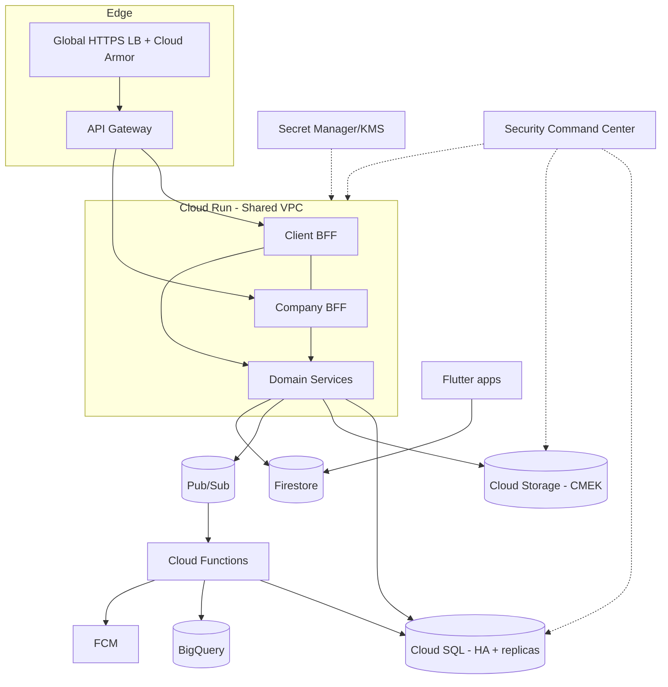

**22.4 Networking & data protection.** Private service connectivity (no public DB IPs); Cloud SQL private IP + IAM auth; **VPC‑SC** perimeter; egress controls; per‑service least‑privilege SAs; CMEK on payments/PII/chat buckets; audit sink to the isolated `security` project.

**22.5 Environments & release.** dev → staging → prod with identical IaC (Terraform); progressive rollout (Cloud Run revisions + traffic splitting) and feature flags; blue/green for risky changes; automated rollback on SLO breach.

---

# 23. Scalability Strategy

Targets: **100 employees, 10,000 customers, 100,000 projects, millions of messages & files.** These are modest for the chosen managed services — the strategy is to lean on Google's horizontal scaling and keep the design stateless and event‑driven.

**23.1 Sizing reality check.** 100k projects × ~hundreds of rows each = low‑tens‑of‑millions of relational rows — comfortable for a single well‑indexed **Cloud SQL** primary + read replicas (not "big data"). Millions of chat messages/files fit **Firestore** (scales to billions of docs) and **Cloud Storage** (effectively unlimited) natively. So the bottlenecks are **hot paths and fan‑out**, not raw volume.

**23.2 Compute.** **Cloud Run** autoscales per‑service on concurrency (0→N), so sales, production and chat‑write traffic scale independently; **min instances** on latency‑critical services to avoid cold starts. Stateless services → trivial horizontal scaling; no sticky sessions (JWT).

**23.3 Data tier.** Cloud SQL: **read replicas** for analytics/read‑heavy endpoints; connection pooling (PgBouncer/Cloud SQL connector — the CRM already pools); careful indexing on hot filters (project_id, stage, assignee, part_uid, ts); partition the append‑only heavy tables (`part_scans`, `audit_log`, `notifications`) by month. If a single primary is ever outgrown, shard by `project_id`/tenant — but that's far beyond the stated scale.

**23.4 Real‑time tier.** Firestore auto‑scales; design keys to avoid hotspots (no monotonically‑increasing single‑doc counters; shard counters if needed); paginate message history; cap group fan‑out with server‑side batching.

**23.5 Async & spikes.** Pub/Sub absorbs bursts (Excel import of thousands of leads, mass scans at shift change, notification storms) and lets workers drain at their own rate — protecting the DB from thundering herds.

**23.6 Caching & cost.** Cache RBAC/role and meta lookups (in‑memory per instance, like the CRM's permission cache; Memorystore/Redis if cross‑instance needed); CDN for static/design‑preview assets; GCS storage classes tiered by age (§13.7); BigQuery for heavy analytics so the OLTP DB stays lean.

**23.7 Performance budgets.** p95 API < 300 ms; chat delivery < 1 s; scan ack < 500 ms; push < a few seconds. Load‑test to 5× target before launch.

---

# 24. Disaster Recovery & Backup Plan

**Objectives:** **RPO ≤ 5 min**, **RTO ≤ 1 hour** for the core transactional system (tunable per your risk appetite; stated as a design target — §30).

**24.1 Backups.**
| Store | Backup method | Retention |
|---|---|---|
| Cloud SQL | Automated daily backups + **PITR** (WAL) | 35 days PITR, monthly archives 1yr+ |
| Firestore | Scheduled managed exports to GCS | 30 days |
| Cloud Storage (files) | **Object versioning** + cross‑region replication | versions 90d; DR copy retained |
| Audit log | WORM/retention‑locked bucket + BigQuery | 7 years (compliance) |
| Config/IaC | Git + Terraform state (versioned, locked) | full history |

**24.2 High availability.** Cloud SQL **regional HA** (synchronous standby, automatic failover); Cloud Run & Firestore are multi‑zone by default; multi‑zone within the primary region; **cross‑region DR** copies of backups + IaC to stand up the stack elsewhere.

**24.3 DR strategy.** Warm‑standby: primary region active; DR region holds replicated backups + deployable IaC. On regional failure: restore Cloud SQL from cross‑region backup/replica, redeploy Cloud Run from Artifact Registry via Terraform, repoint DNS. **Immutable, offline‑restorable backups** are the ransomware safety net (§21).

**24.4 Testing.** Quarterly **restore drills** (prove backups actually restore), documented failover runbooks, game‑days; backup‑success monitoring with alerts; annual full DR exercise. A backup that hasn't been test‑restored is not a backup.

**24.5 Graceful degradation.** If chat (Firestore) is down, core transactions continue; if a gateway is down, booking queues; if a service is degraded, feature flags shed non‑critical load. Clients are offline‑capable (queue writes, sync later) — vital for factory dead zones and site locations.

---

# 25. UI/UX Navigation Structure

Two apps, two information architectures, **role‑adaptive** within the Company App (the same app renders different tabs per role — like the web CRM's permission‑filtered nav).

**25.1 Company App (role‑adaptive bottom nav + contextual screens).**
```
Home (role dashboard)  |  Projects  |  Chats  |  Tasks/Approvals  |  More
```
- **Marketing Head:** Home (company KPIs) · **Leads/Import** · Projects (all, silent) · Chats (+ oversight) · Approvals · Analytics.
- **Project Manager:** Home (my projects) · Leads (assign) · **Projects (board)** · Chats · **Approvals (estimates/expenses)** · Team.
- **Sales Executive:** Home (my leads) · **Leads/CRM** · **Create Estimate** · Chats (customers) · Payments.
- **Designer:** Home (assigned) · **Design workspace** · Chats · Files.
- **Production Engineer:** Home (production queue) · **Factory floor / Scanner** · Cut lists · Chats · Checklists.
- **Site Manager:** Home (site tasks) · **Site console (checklists/scan)** · **Tickets** · **Expenses** · Chats.

**25.2 Client App (simple, reassuring, 4 tabs).**
```
My Project (timeline)  |  Chat  |  Estimates & Payments  |  Designs & Files
```
Progressive disclosure: pre‑booking shows only *Chat + Estimate/Pay*; post‑booking unlocks the full project timeline, group chat and design review.

**25.3 Cross‑cutting UX.** Global search; notification center; offline indicators + queued‑action badges; large tap targets & camera‑first flows for factory/site (scanning, photos) — often one‑handed, gloved, poor‑light contexts; accessibility (contrast, font scaling, screen‑reader labels — reuse the web CRM's calm "bone/clay" design language for brand continuity). Localization‑ready (English + regional languages).

**25.4 Key flows get dedicated wizards.** Create Estimate, Book/Pay, Convert‑to‑Group, Publish Cut List, Scan‑to‑advance, Raise Ticket, Complete Checklist — each a guided, few‑step flow with clear confirmation and undo where safe.

---

# 26. Admin Console Design

A **web** console (not mobile) for the **System Administrator / CEO / Tester** super‑accounts — high‑privilege, low‑frequency operations best on a larger screen. Extends the web CRM's Settings/Module‑7 UI.

**26.1 Capabilities.** User & employee lifecycle (create/deactivate/hierarchy `reports_to`); **role & permission catalog** (create custom roles, edit permission sets — Module 7); org/tenant config; integration config (payment gateway, SMS, Maps, FCM keys — via Secret Manager, never shown in plaintext); **audit log explorer** (search/filter/export, incl. MH‑oversight entries); security dashboards (SCC posture, failed‑auth, anomalies); data governance (export/delete for GDPR/DPDP, legal holds); feature flags; **break‑glass** access with mandatory reason + review.

**26.2 Guardrails.** MFA + step‑up for every sensitive action; the CEO/Tester super‑accounts are protected (can't be deleted — as already built); all admin actions audited; separation of duties (an admin can't approve their own break‑glass); IP/geo allow‑list for the console; session recording for privileged sessions (optional).

---

# 27. Client Application Design

**Goal:** build **trust and momentum** — a homeowner spending lakhs wants clarity, proof of progress, and easy payment. Minimal, elegant, zero jargon.

**27.1 Onboarding & auth.** Phone/email + OTP (reuse CRM OTP); optional Google Sign‑In; the customer's **phone & email are their identity keys**. A customer only exists in the app once a Sales Executive engages their lead.

**27.2 Screens.**
- **My Project timeline:** the customer‑friendly milestone track (§5) with friendly labels, ETA, and a coarse production progress bar (never part‑level internals).
- **Chat:** pre‑booking = 1:1 with the Sales Executive; post‑booking = the project group (team visible, **MH never visible**), with images/video/**voice notes**, replies, read receipts, file preview.
- **Estimates & Payments:** view estimate PDF (customer‑safe columns only), **Accept**, pay the **10% booking** (and later milestones), receipts, payment history.
- **Designs & Files:** review shared 2D/3D (image/PDF; DWG shown as rendered preview), **Approve final design**, download shared files.
- **Support/After‑sales:** raise a post‑install request (routes to PM), FAQ, warranty.

**27.3 Trust & safety.** No internal data ever reachable (dual BFF); clear payment security cues; content moderation/report on chat; privacy controls (export/delete my data); push consent.

**27.4 Play/App Store compliance.** Clear data‑safety disclosure, privacy policy, permission justifications (camera for design photos, notifications), no restricted permissions, age/consent handling, in‑app‑purchase rules respected (payments are for services, via gateway — not digital goods).

---

# 28. Company Application Design

**Goal:** a fast, role‑aware operations tool that works in offices, factories and sites. Same Flutter codebase, **one app whose surface is shaped by the user's role** (permission‑filtered, like the web CRM's nav).

**28.1 Cross‑role foundations.** Role dashboard on Home; global chat (all planes the user may see); notification center + approvals inbox; offline‑first with sync; camera/scanner as first‑class inputs; deep search across leads/projects/parts/files.

**28.2 Role surfaces (highlights).**
- **Marketing Head:** Excel **import** (the one exclusive power) + equal split to PMs; company‑wide analytics; **silent** project & chat oversight (a discreet "oversight" section, invisible to others); everything a PM can do.
- **Project Manager:** the **Projects board** (the split‑out Projects page concept from the web CRM — Booking→Factory); lead assignment (manual + **random equal split**); **approvals** (estimate, expense); **create project group + add members** (the DM→group conversion action); full project & communication visibility for owned projects.
- **Sales Executive:** lead/CRM parity with the web app (this is the "look into the current CRM architecture — we need the same" requirement); **Create Estimate** wizard; submit‑for‑approval; share; collect booking; then hand into design. Customer chat begins here.
- **Designer:** design workspace (upload/version DWG/PDF/JPG/PNG, share to customer, revisions, mark final); design chat.
- **Production Engineer:** **factory floor console** — production queue, **QR scanner**, cut‑list publish, Part‑ID/QR generation, QC pass/fail, packing, **factory final checklist**, dispatch; live sync with Designer & Site Manager.
- **Site Manager:** **site console** — unload reconciliation (scan vs loaded manifest), installation checklist, **raise tickets (photos)**, **site bill capture → PM approval**, vendor coordination, completion checklist & sign‑off.

**28.3 Consistency.** Shared component library, the brand design language, consistent stage/status vocabulary with the web CRM, and the same RBAC keys — so web and mobile stay coherent and a change to a permission applies everywhere.

---

# 29. Recommended Technology Stack

Chosen for **Google‑native fit, one team/one codebase, and maximum reuse of the existing CRM** (so we extend proven business logic instead of rebuilding it).

| Layer | Recommendation | Why |
|---|---|---|
| **Mobile (both apps)** | **Flutter (Dart)** | Single codebase → Company + Client apps; Google's own framework; excellent camera/QR, offline, push; Android‑first (your "Google applications") + iOS‑ready at no extra codebase |
| **Auth** | **Firebase Auth + Google Identity**, App Check, MFA | Managed OAuth/OIDC, Workspace SSO for staff, OTP for customers (reuse CRM OTP), device attestation |
| **Real‑time** | **Firestore** + Firebase SDK | Chat, presence, typing, read‑receipts, offline sync out of the box |
| **APIs / BFFs** | **Cloud Run** hosting **FastAPI (Python)** | **Reuse the CRM's Python services** (leads, stages, gates, RBAC, audit, documents); autoscaling, containerized already |
| **System of record** | **Cloud SQL for PostgreSQL** | Reuse & extend the CRM schema; strong consistency for money/parts/audit; HA + replicas |
| **Files** | **Cloud Storage** | Signed URLs, lifecycle, CMEK, virus scan hook |
| **Events/async** | **Pub/Sub + Cloud Functions** | Decoupled hand‑off fan‑out, spike absorption |
| **Push / Email / SMS** | **FCM** / Workspace‑SMTP / pluggable SMS | Reuse CRM notification + OTP patterns |
| **Analytics** | **BigQuery + Looker Studio** | Dashboards, daily summaries, traceability queries |
| **Maps** | **Google Maps Platform** | Site geolocation, dispatch |
| **Specialized render** | **Cloud Run jobs** | Label/QR service (your Label Generator plugs in), PDF, DWG→preview |
| **Security/edge** | **API Gateway + Cloud Armor**, Secret Manager, Cloud KMS, Security Command Center | WAF/DDoS/rate‑limit, secrets, keys, posture |
| **IaC / CI‑CD** | **Terraform + Cloud Build + Artifact Registry** (+ Binary Authorization) | Reproducible, policy‑gated, signed images |
| **Observability** | **Cloud Logging/Monitoring/Trace** | SLOs, alerting, tracing |

**Alternative considered:** React Native (rejected — Flutter is more Google‑aligned and gives better single‑codebase camera/offline). Full‑Firestore‑only backend (rejected — financial/traceability data needs relational integrity + we already own a PostgreSQL domain model). Rebuild services in Node (rejected — throws away the working, tested Python CRM logic).

**Reuse ledger (what we carry over from the web CRM):** the PostgreSQL schema + migrations, the RBAC/Module‑7 permission engine, the audit module (extended to hash‑chain), the Meta/Excel lead importer, the document/object‑storage pattern, the OTP flow, the notification/SMTP sender, the stage/gate state machine, the Label Generator slot, and the calm brand design language.

---

# 30. Risks, Assumptions, and Recommendations

### 30.1 Explicit assumptions (please confirm/correct)
1. **"Google applications" = Play‑Store Flutter apps on Firebase/GCP** (iOS optional later). If you meant *Google Workspace Add‑ons/Apps Script apps*, the architecture changes materially — **confirm**.
2. **Payment gateway is TBD** (Razorpay/PayU/Cashfree/UPI). Gateway choice affects §16 specifics.
3. **3rd‑party fitting vendors are not first‑class app users in v1** (managed by the Site Manager). Optional lightweight OTP‑link vendor access later.
4. **Customers authenticate** (phone/email OTP) — the customer becomes a real app user, unlike the web CRM where a lead is just a record.
5. **Estimate pricing logic comes later** from your structured Excel; the engine is built pluggable to receive it.
6. **RPO ≤ 5 min / RTO ≤ 1 hr** are proposed targets, not yet ratified by you.
7. **Single region (India) primary** with cross‑region DR copies; data residency in India.

### 30.2 Conflicts with the web CRM (resolved in favor of your new instructions, per your directive)
- **Roles:** the CRM's `manager/sales/designer/supervisor` become PM/SE/DES/SM; we **add Marketing Head and Production Engineer**, and model the two superset relationships. (Custom‑role engine already supports adding these.)
- **Site Measurement stage (5):** the new flow de‑emphasizes it; recommendation is to keep it **optional/non‑gating** (see §6 note) — **your call** to keep or drop.
- **Chat, QR full lifecycle, Client App, online payments** are **new** beyond the current CRM and are the bulk of the build.
- **Customer identity:** new (customers log in). 

### 30.3 Key risks & mitigations
| Risk | Impact | Mitigation |
|---|---|---|
| **Invisible‑MH leak** (roster/receipt/presence) | Trust/legal | Server‑side hidden‑member exclusion everywhere + Firestore rules; pen‑test this specifically (§12.2, §21.3) |
| **Cross‑boundary data leak** (customer sees internal) | Severe | Dual BFF, row‑scoping, DLP on shared files (§8, §20) |
| **Payment tampering/fraud** | Financial | Server‑authoritative amounts, signed idempotent webhooks, PCI‑offloaded gateway (§16) |
| **QR forgery / faked progress** | Ops integrity | Signed QR payloads, role+station validation, evidence, audit (§14.7) |
| **Scope creep** (30 modules at once) | Delivery risk | Strict phasing (below); ship parity first, then new modules |
| **Play/App‑store rejection** | Launch delay | Early data‑safety/privacy compliance, permission minimization (§27.4) |
| **Offline factory/site connectivity** | Data loss | Offline‑first clients, queued scans/writes, idempotency (§23/§24) |
| **DLP on customer‑shared design files** | Leak | Re‑render previews, strip metadata, visibility=customer gating (§13) |

### 30.4 Recommended phased roadmap
- **P0 — Foundation (parity):** GCP landing zone + security baseline; Auth/MFA/RBAC (port CRM); Lead intake (Excel import) + distribution (MH→PM→SE) + CRM/lead handling parity; Projects board. *Value: the web CRM's core, now mobile + Marketing‑Head hierarchy.*
- **P1 — Commercialize:** Estimate engine (pluggable) + approval; **Chat** (1:1 → group, invisible MH); **Booking payment** + activation + group conversion. *Value: the sales→booking pivot fully digital.*
- **P2 — Deliver:** Design collaboration + approval; **Production + Cut List + Part IDs + QR + scans + QC + factory checklist + dispatch**. *Value: the manufacturing traceability spine.*
- **P3 — Install & close:** Site console, load/unload reconciliation, tickets (photos), site expenses/approval, installation & completion checklists, after‑sales; Client App polish. *Value: closed loop end‑to‑end.*
- **P4 — Scale & harden:** BigQuery analytics + daily summaries; escalations; DR drills; pen‑test; performance/load; store launch.

### 30.5 Decisions I need from you to proceed to detailed design/build
1. Confirm **assumption #1** (Flutter/Firebase mobile apps) — this unblocks everything.
2. **Payment gateway** preference (and do you want auto‑activation on verified webhook, or a manual PM verify step?).
3. **Site Measurement stage** — keep (optional) or remove from the mobile flow?
4. **Vendor access** — SM‑managed only (v1) or lightweight vendor app/OTP link?
5. **RPO/RTO** targets — accept the proposed ≤5 min / ≤1 hr, or state yours?
6. When ready: the **estimate Excel** (pricing) and your **Label Generator** code — to wire the two pluggable engines.

Answer these and I'll proceed to the next layer (detailed data schemas, API contracts, Firestore security rules, and a build‑ready backlog) — and, when you say go, start implementation phase P0.

---

## Document status

**Sections 1–30 complete** across 5 installments (this file). This is the **design/architecture deliverable** you asked for (explicitly *not* implementation yet). Building the two apps will proceed in phases (§30.4) once the §30.5 decisions are confirmed — and, as you noted, will span multiple build cycles, which the phasing is designed to absorb.

*Prepared as: Enterprise Solution / Google Cloud / Mobile / Cybersecurity / Database / UX Architect & Business Process Consultant. Deviations from the existing web CRM were resolved in favor of the instructions in this brief, per your directive.*
